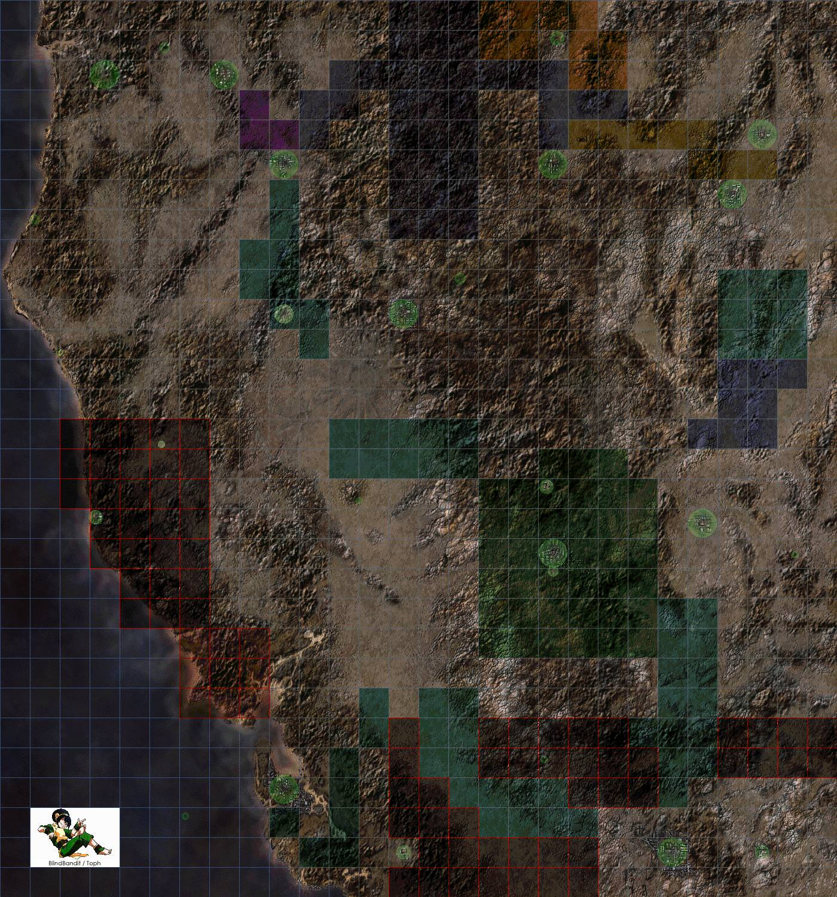

# Карта мира
## Общая информация
Карта мира, или глобальная карта, так же называемая между игроками, как "глобал".
Представляет собой зону, состоящую из 840 квадратов ( 28 х 30 ). Начиная с координат 0:0 заканчивая 27:29.
Передвигаясь по глобальной карте, игрок может находить **случайные встречи** определенного характера.

## Скорость перемещения по глобальной карте
Скорость перемещения по глобальной карте у всех персонажей изначально одинаковая, и не зависит от начальных параметров созданного персонажа. Скорость можно увеличить несколькими способами:
- Перк **следопыт**
- Сенсор движения в дополнительном слоте
- Вставить имплант на трекинг
- Передвигаться по глобальной карте на транспорте1

## Случайные встречи
Перемещаясь по глобальной карте есть шанс найти случайные встречи.

Частота случайных встреч зависит от:
- Увеличение шанса на встречу
    - Золотой кулон в дополнительном слоте
    - Активированный сенсор движения в дополнительном слоте
    - Дневное время суток
- Уменьшение шанса на встречу
    - Талисман в дополнительном слоте
    - Сенсор движения в дополнительном слоте
    - Ночное время суток

Шанс сфейлится при нахождении случайной встречи зависит от:
- Количество скитальца у персонажа
- Сложности зоны по которой ходит игрок
- Наличия перков **следопыта**, **рейнджера**, **непоследы**
- Идет ли игрок в скрытности

Если на клетке по которой двигается игрок, находится другой игрок, то шанс сфейлится высчитывается по другому:
```
Шанс = ( 300 + скит - СкитИгрокаНаЭнке ) / 6 + бонус.
Бонусы:
Непоследа = 5
Следопыт = 2
Рейнджер = 1
```

## Уникальные встречи
Игрок может найти уникальную встречу. В разных частях глобальной карты находятся разные уникальные встречи. Шанс найти уникальную энку намного меньше шанса обычной стычки.
Перк **непоседа** увеличивает шанс на нахождение уникальных встреч.
На некоторых из уникальных энкаунтеров могут находится уникальные предметы.
- Одни из которых:
- Бластер пришельцев
- Святая граната
- Кошачья лапка выпуск №5
- Мантия стража моста
- Статуэтка рыцаря
- Маргаритки

## Энкаунтеры
Сами энкаунтеры представляют собой рельеф постъядерной пустоши. Наполнение энкаунтера зависит от зоны в которой игрок его нашел.
На энкаунтере можно найти различный хлам, раскиданный по всей его площади.

Игрок может просто упасть на энкаунтер, нажав соответствующую кнопку на глобальной карте (войти), если на этой клетки нет созданных другими игроками энкаунтеров, то игрок упадет на пустой, только что созданный им энкаунтер без животных или каких либо НПЦ.
Если была встреча с животными или НПЦ, то они будут находится на энкаунтере. Враждебные животные или НПЦ начинают преследовать игрока через несколько секунд после того, как он упал на энкаунтер. Если у игрока взят трейт добродушие, то большинство агрессивных НПЦ будут его игнорировать, но агрессивные животные начнут преследовать игрока без задержки.

Энкаунтер существует до тех пор, пока на нем находится хотя бы один живой игрок или транспорт, после того, как последний живой игрок выходит с энкаунтера, он закрывается.

Существует функционал подстветки энкаунтеров. Если игрок упал на энкаунтер на транспорте, то он подсветится зеленым кругом. В этом случает, игроки нажав войти на зеленом круге, сразу же упадут на энкаунтер с транспортом.
Другой способ подсветки энкаунтера, это активация сенсора движения на уже созданном энкаунтере.

## Карта мира
На карте отмечены опасные зоны (красным), пути торговых караванов.

<a href="img/map.jpg" target="_blank"></a>