# Способности / Перки (28 сессия)

Способность (англ. Perk) — бонус в ролевой системе SPECIAL, предоставляемый персонажу с достижением определенного уровня (также аналогичные способности есть у некоторых единиц вооружения). Обычно скорость получения способностей для персонажей равна трём (то есть выбор будет предоставляться на каждом третьем уровне), кроме персонажей с особенностью "Умелец". По достижению 28 уровня возможен выбор только софткапных перков. Почти все способности требуют определенных свойств персонажа, таких как уровень, основные характеристики, навыки, карма и другие.  

Некоторые способности могут выбираться несколько раз.

**Список перков**

  
Содержимое:

  - [Перки 2 уровня](#перки-2-уровня)
  - [Перки 6 уровня](#перки-6-уровня)
  - [Перки 9 уровня](#перки-9-уровня)
  - [Перки 12 уровня](#)
  - [Перки 15 уровня](#)
  - [Перки 30 уровня](#)
  - [Перки после софт капа](#)
  - [Мастер перки](#)
  - [Квестовые перки](#)
  - [Функциональные перки](#)

## Перки 2 уровня

### Бонус движения
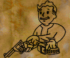

**Разряды:** `1`  
**Требования:**  
- `Ловкость: 3`
- `Макс. уровень: 29`

**Эффект:**  
- `Каждые 10 секунд вы восстанавливаете 1 ОД.`

---
### Быстрая реакция
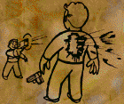

**Разряды:** `2`  
**Требования:**  
- `Восприятие: 7`
- `Макс. уровень: 29`

**Эффект:**  
- `+4 к Порядку действий.`

---
### Больше крит. атак
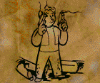

**Разряды:** `1`  
**Требования:**  
- `Восприятие: 6`
- `Макс. уровень: 29`

**Взаимоисключения:**  
- `Перк: Бесшумный бег`

**Эффект:**  
- `+10% к Шансу на критическую атаку.`

---
### Переноска
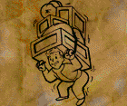

**Разряды:** `1`  
**Требования:**  
- `Сила: 6`
- `Выносливость: 6`
- `Макс. уровень: 29`

**Эффект:**  
- `+50% к Атлетизму.`
- `+100 к Переносимому грузу.`
- `33% шанс избежать катание от дробовиков.`

---
### Образование

**Разряды:** `1`  
**Требования:**  
- `Макс. уровень: 29`

**Эффект:**  
- `+50 к Очкам умений.`

---
### Оптимизация
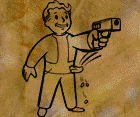

**Разряды:** `1`  
**Требования:**  
- `Ловкость: 5`
- `Макс. уровень: 29`

**Эффект:**  
- `-1 ОД к стоимости перезарядки.`
- `+40% шанс восстановить 1 ОД при перезарядке.`
- `25% шанс восстановить 1 ОД при использовании предмета.`

---
### Самоучка

**Разряды:** `3`  
**Требования:**  
- `Интеллект: 6`
- `Макс. уровень: 29`

**Эффект:**  
- `+15% к получаемому опыту.`
- > 💡 **Примечание:** `Перк можно получить при Рейтинге 50 и больше у АХС-9 в Сан-Франциско за 200000 монет с инвентаря.`

---
### Осведомленность
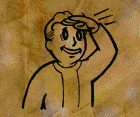

**Разряды:** `1`  
**Требования:**  
- `Восприятие: 5`
- `Макс. уровень: 29`

**Эффект:**  
- `Вы можете видеть ОЗ, предметы в руках и броню персонажей.`
- `При выстреле по противнику вы узнаете его % антикрита и % уворота.`

---
### Эгоист
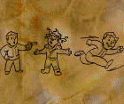

**Разряды:** `1`  
**Требования:**  
- `Харизма: 5`
- `Макс. уровень: 29`

**Эффект:**  
- `Вы выходите из боевого режима при лечении Санитаром если вы не отравлены и не облучены.`

---
### Мастер ближнего боя
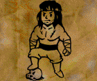

**Разряды:** `1`  
**Требования:**  
- `Ловкость: 7`
- `Макс. уровень: 29`

**Эффект:**  
- `При атаке рукопашным или холодным оружием к вашему урону добавляется рандомное значение вашей Силы.`

---
### Бдительность
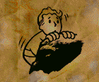

**Разряды:** `1`  
**Требования:**  
- `Восприятие: 6`
- `Макс. уровень: 29`

**Эффект:**  
- `+3 к гексам Обзора.`
- `Вы восстанавливаете 1 ОД при промахе`

---
### Наблюдательность

**Разряды:** `1`  
**Требования:**  
- `Интеллект: < 7`
- `Макс. уровень: 29`

**Эффект:**  
- `+1 к Интеллекту.`
- `Вы получаете 200 очков опыта за каждую прочитанную книгу.`

---
### Быстрота
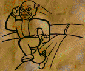

**Разряды:** `1`  
**Требования:**  
- `Харизма: 5`
- `Макс. уровень: 29`

**Эффект:**  
- `+1 к ОД.`

## Перки 6 уровня

### Бонус точности
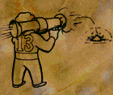

**Разряды:** `1`  
**Требования:**  
- `Удача: 4`
- `Макс. уровень: 29`

**Эффект:**  
- `+(Количество попавших пуль+10) к урону очереди.`

---
### Быстрое лечение
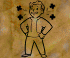

**Разряды:** `1`  
**Требования:**  
- `Выносливость: 8`
- `Макс. уровень: 29`

**Эффект:**  
- `+(Харизма * 3) к Уровню лечения.`
- `-0,2 секунды к задержке на использование медикаментов и наркотиков.`
- `Вы восстанавливаете (Максимальное ОД/4) ОД при лечении Санитаром.`

---
### Крутизна
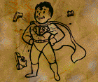

**Разряды:** `1`  
**Требования:**  
- `Сила: 7`
- `Макс. уровень: 29`

**Эффект:**  
- `+2 ко всем трешхолдам`
- `+5% к резистам Нормы и Огня.`

---
### Меткость
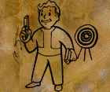

**Разряды:** `1`  
**Требования:**  
- `Интеллект: 6`
- `Макс. уровень: 29`

**Эффект:**  
- `+2 к Восприятию если Восприятие 3 и меньше.`
- `+2 к Восприятию при расчете точности.`
- `+6 к гексам Обзора.`
- `-5% к Увороту цели.`

### Двуличный
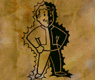

**Разряды:** `1`  
**Требования:**  
- `Харизма: 6`
- `Макс. уровень: 29`

**Эффект:**  
- `+8 к урону.`
- > 💡 **Примечание:** `Бонус к урону не работает на оружие с типом урона Огонь.`

---
### Человек действия
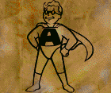

**Разряды:** `1`  
**Требования:**  
- `Ловкость: 6`
- `Макс. уровень: 29`

**Эффект:**  
- `+1 к ОД.`

---
### Счастливчик
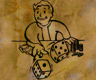

**Разряды:** `1`  
**Требования:**  
- `Удача: 3`
- `Макс. уровень: 29`

**Эффект:**  
- `+(Удача) к роллу крита.`
- > 💡 **Примечание:** `Сумма ролла крита не больше 10.`
- > 💡 **Примечание:** `Крит ролл и ролл крита это разные вещи. Ролл крита это проверка на второй крит. эффект по вам при критическом попадании. Формула: Рандом(1, 10) > (SPECIAL + счастливчик), при 10 спешила шанс = 0%`
- `(Удача - Удача атакующего)% шанс что одиночная атака по вам нанесет 1 урон.`
- `(Удача)% шанс полностью восстановить ваше ОЗ и ОД при использовании Доктора.`

---
### Фанат дробовиков
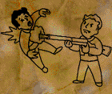

**Разряды:** `1`  
**Требования:**  
- `Интеллект: 6`
- `Легкое оружие: 160%`
- `Макс. уровень: 29`

**Эффект:**  
- `+30% к Легкому оружию, +20% к Ремонту.`
- `+12 к урону дробовиков.`

---
### Привидение
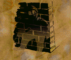

**Разряды:** `1`  
**Требования:**  
- `Макс. уровень: 29`

**Эффект:**  
- `+40% к Скрытности.`
- `Каждые 10 секунд вы восстанавливаете 1 ОД если вы в Скрытности.`

---
### Отличник

**Разряды:** `1`  
**Требования:**  
- `Восприятие: 7`
- `Макс. уровень: 29`

**Эффект:**  
- `+5% к резистам от типов урона Плазма, Лазер, Электричество.`
- `Иммунитет к сжиганию ОД.`

---
### Непоседа
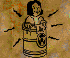

**Разряды:** `1`  
**Требования:**  
- `Макс. уровень: 29`

**Эффект:**  
- `+(Сила*5) к ОЗ.`
- `Увеличение шанса на поиск уникальной локации`

---
### Полевой санитар
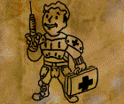

**Разряды:** `1`  
**Требования:**  
- `Санитар: 60%`
- `Доктор: 40%`
- `Макс. уровень: 29`

**Эффект:**  
- `-4 секунды к восстановлению Санитара.`
- > 💡 **Примечание:** `Время восстановление санитара = 40 секунд.`
- `+((Интеллект+Удача)*3) к лечению Санитаром.`
- `(Удача*2)% шанс полностью восстановить ОЗ при использовании Санитара.`

---
### Крутой парень
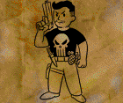

**Взаимоисключения:**  
- `Перк: Бесшумный бег`

**Разряды:** `1`  
**Требования:**  
- `Макс. уровень: 29`

**Эффект:**  
- `(Порядок>Рандом(0,ПорядокПротивника+100))% шанс сжечь 3 текущих ОД у цели при вашей атаке.`
- > 💡 **Примечание:** `Сжигание ОД работает на погексовые атаки.`
- `Игнорирование требования Силы на дальность атаки Метательного оружия.`
- `Игнор бонусов жертвы на срез урона при атаке в небоевом режиме.`

---
### Ковбой
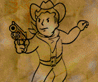

**Взаимоисключения:**  
- `Трейт: Добродушие`
- `Перк: Бесшумный бег`
- `Перк: Снайпер`

**Разряды:** `1`  
**Требования:**  
- `Ловкость: 8`
- `Легкое оружие: 180%`
- `Макс. уровень: 29`

**Эффект:**  
- `При атаке пистолетом типа Легкое оружие:`
  - `Вы восстанавливаете 1 ОД если атака была прицельной.`
  - `+5% к Шансу на критическую атаку.`
  - `Ваша атака вводящая в боевой режим выбивает патроны у цели в инвентарь.`
  - > 💡 **Примечание:** `Солнечному скорчеру выбить патроны невозможно.`

---
### Голем
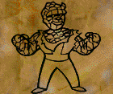

**Разряды:** `1`  
**Требования:**  
- `Харизма: 4`
- `Макс. уровень: 29`

**Эффект:**  
- `На персонаже не срабатывают растяжки и мины.`

---
### Ярость
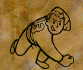

**Разряды:** `1`  
**Требования:**  
- `Рукопашное: 200%`
- `Макс. уровень: 29`

**Эффект:**  
- `Яростный удар валит противника на пол, добавляет 8 к урону и снимает 1 ОД.`
- > 💡 **Примечание:** `Кд удара 10 секунд, Кд общий с Ударом Вора.`

---
### Атлет
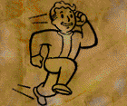

**Разряды:** `1`  
**Требования:**  
- `Атлетизм: 50%`
- `Макс. уровень: 29`

**Эффект:**  
- `+50% к Атлетизму.`
- `-2 секунды к выходу из боевого режима.`
- > 💡 **Примечание:** `Выход из боевого режима не может быть меньше 5 секунд.`

---
### Получить силу
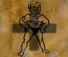

**Разряды:** `1`  
**Требования:**  
- `Сила: < 10`
- `Макс. уровень: 29`

**Эффект:**  
- `+1 к Силе.`
- `+20 к ОЗ.`

---
### Получить восприятие

**Разряды:** `1`  
**Требования:**  
- `Восприятие: < 10`
- `Макс. уровень: 29`

**Эффект:**  
- `+1 к Восприятию.`
- `+20 к ОЗ.`

---
### Получить выносливость
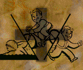

**Разряды:** `1`  
**Требования:**  
- `Выносливость: < 10`
- `Макс. уровень: 29`

**Эффект:**  
- `+1 к Выносливости.`
- `+20 к ОЗ.`

---
### Получить харизму
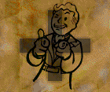

**Разряды:** `1`  
**Требования:**  
- `Харизма: < 10`
- `Макс. уровень: 29`

**Эффект:**  
- `+1 к Харизме.`
- `+20 к ОЗ.`

---
### Получить интеллект

**Разряды:** `1`  
**Требования:**  
- `Интеллект: < 10`
- `Макс. уровень: 29`

**Эффект:**  
- `+1 к Интеллекту.`
- `+20 к ОЗ.`

---
### Получить ловкость
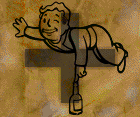

**Разряды:** `1`  
**Требования:**  
- `Ловкость: < 10`
- `Макс. уровень: 29`

**Эффект:**  
- `+1 к Ловкости.`
- `+20 к ОЗ.`

---
### Получить удачу
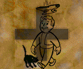

**Разряды:** `1`  
**Требования:**  
- `Удача: < 10`
- `Макс. уровень: 29`

**Эффект:**  
- `+1 к Удаче.`
- `+20 к ОЗ.`

---
### Верткость
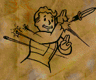

**Разряды:** `1`  
**Требования:**  
- `Харизма: 2`
- `Макс. уровень: 29`

**Эффект:**  
- `+(Текущие ОД / 2)% к Увороту.`

---
### Легкие шаги
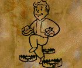

**Разряды:** `1`  
**Требования:**  
- `Ловкость: 5`
- `Макс. уровень: 29`

**Эффект:**  
- `+5 к Трешхолду от Огня.`
- `+15% к Резисту от Взрыва.`
- `-50% к урону Ловушек по вам.`
- `50% шанс избежать активацию Ловушки.`
- > 💡 **Примечание:** `Активируемые ловушки: капканы, растяжки, мины и т.д.`
- `50% шанс избежать крит. эффекта нокдаун`

---
### Человек-глыба
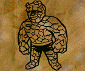

**Разряды:** `1`  
**Требования:**  
- `Сила: 6`
- `Макс. уровень: 29`

**Эффект:**  
- `Атака по вам вводящая в боевой режим наносит в 2 раза меньше урона.`
- > 💡 **Примечание:** `Не работает на погексовые атаки.`
- `Оружие не выпадает из рук при критическом промахе или критической атаке по вам.`
- `Иммунитет к шансовому Подавлению от перка Огневая поддержка.`
- `50% шанс избежать падение.`
- > 💡 **Примечание:** `Избегание падения не работает против беретты 2050 оса`

---
### Опытный медик
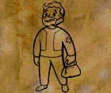

**Разряды:** `1`  
**Требования:**  
- `Доктор: 80%`
- `Макс. уровень: 29`

**Эффект:**  
- `При лечении санитара минимум лечения берется как среднее значение первоначального максимума и минимума лечения.`
- `При расчетах получение Раны к удаче добавляется 5.`

---
### Зоркий
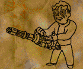

**Разряды:** `1`  
**Требования:**  
- `Восприятие: 5`
- `Макс. уровень: 29`

**Эффект:**  
- `Игнорирование штрафа дыма на атаки очередью.`

---
### Цепной пёс
> ⚠️ **Warning:** `Требуется картинка`

**Взаимоисключения:**  
- `Трейт: Вор`

**Разряды:** `1`  
**Требования:**  
- `Интеллект: 7`
- `Ловкость: 6`
- `Рукопашное или Холодное оружие: 200`
- `Макс. уровень: 29`

**Эффект:**  
- `Если до противника меньше 16 клеток, то вы получаете (15-дистанция)% к увороту против его дистанционных атак, но не более капа уворота`

---
### Прицел
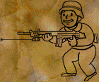

**Разряды:** `1`  
**Требования:**  
- `Макс. уровень: 29`

**Эффект:**  
- `+((60 - Дистанция) / 2)% к навыку при расчетах штрафа дыма.`

---
### Лечение
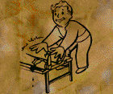

**Разряды:** `1`  
**Требования:**  
- `Санитар: 40%`
- `Макс. уровень: 29`

**Эффект:**  
- `+40 к лечению Санитаром.`
- `+20 к лечению Санитаром при ношении в дополнительном слоте сумки парамедика.`
- `+20 к лечению Санитаром другого персонажа и лечению Санитаром от другого персонажа.`
- `+5 к лечению Суперстимулятором.`

## Перки 9 уровня

### Лучшие крит. атаки
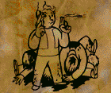

**Разряды:** `1`  
**Требования:**  
- `Восприятие: 6`
- `Ловкость: 4`
- `Макс. уровень: 29`

**Эффект:**  
- `+20 к критическому роллу.`

---
### Увертливость
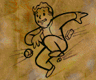

**Разряды:** `1`  
**Требования:**  
- `Удача: 3`
- `Макс. уровень: 29`

**Эффект:**  
- `+10% к Увороту.`

---
### Вор-профессионал
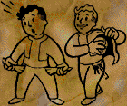

**Разряды:** `1`  
**Требования:**  
- `Взлом замков: 150%`
- `Макс. уровень: 29`

**Эффект:**  
- `+40% к Взлому замков и Воровству.`
- `Отмычки не ломаются при взломе и не требуют Ловкость и Интеллект для снижения сложности замка.`
- `Вы можете открывать контейнеры монтировкой если Взлом замков 200% и больше.`
- `Время восстановление ОЗ от Уровня лечения становиться каждые 10 секунд если вы в Скрытности.`

---
### Ящерица
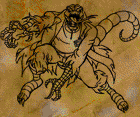

**Разряды:** `1`  
**Требования:**  
- `Сила: 7`
- `Макс. уровень: 29`

**Эффект:**  
- `50% шанс восстановить (Сила*2) ОЗ если атака по вам 65 урона и больше.`

---
### Глаза и уши
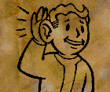

**Разряды:** `1`  
**Требования:**  
- `Макс. уровень: 29`

**Эффект:**  
- `+2 к Восприятию.`

---
### Пироманьяк
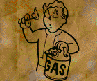

**Разряды:** `1`  
**Требования:**  
- `Интеллект: 4`
- `Макс. уровень: 29`

**Эффект:**  
- `+50% к защите от тиков огня`
- `+20 к урону для оружия с типом урона Огонь.`
- `+15 к тикам Огня.`
- > 💡 **Примечание:** `Тики огня не работают на персонажей с трейтом Жидкое тело и на персонажей в боевой броне Анклава, огнеупорной броне или моторизованной броне.`
- > 💡 **Примечание:** `Моторизованная броня: cиловая броня, закаленная силовая броня, улучш. силовая броня, улучш. силовая броня мод. II, РБК и РБК II.`
- > 💡 **Примечание:** `Урон тика огня при прямом нанесении урона огнем = (10 + (Пироманьяк * 15) + (Мастер огня * 2)).`
- > 💡 **Примечание:** `Урон тика огня при ходьбе по гексу с огнем = (5 + (Пироманьяк * 10) + (Мастер огня * 2)).`

---
### Прыгучесть
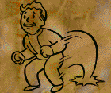

**Разряды:** `1`  
**Требования:**  
- `Ловкость: 5`
- `Макс. уровень: 29`

**Эффект:**  
- `+1 к ОД.`
- `Быстрое восстановление из Нокаута и Нокдауна.`
- > 💡 **Примечание:** `Нокдаун = (Текущие ОД-6 ОД), с перком Прыгучесть = (Текущие ОД-3 ОД).`
- > 💡 **Примечание:** `Нокаут = -(Максимальное ОД), с перком Прыгучесть = -(Максимальное ОД/1,5).`

---
### Токсиколог
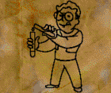

**Разряды:** `1`  
**Требования:**  
- `Наука: 180%`
- `Макс. уровень: 29`

**Эффект:**  
- `Иммунитет к контактному отравлению.`
- > 💡 **Примечание:** `Контактное отравление то - которое действует на вас через удары или выстрелы`
- `+(10-(Выносливость цели/2)) к урону по НПС.`
- `При атаке одиночным выстрелом оружием с типом норма вы отравляете цель на 20 уровней отравления и если Устойчивость к яду у цели выше 75%, то расчет будет как при 75%.`
- `При броске газовой гранаты в гексе попадания образуется токсичная лужа, которая травит если по ней пройти.`
- > 💡 **Примечание:** `НПС не могут быть отравлены, только игроки.`
- > 💡 **Примечание:** `При отравлении входящий уровень отравления уменьшаются на (Устойчивость к яду)%.`

---
### Огневая поддержка
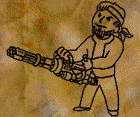

**Разряды:** `1`  
**Требования:**  
- `Восприятие: 7`
- `Ловкость: 7`
- `Метательное оружие: 100%`
- `Макс. уровень: 29`

**Эффект:**  
- `+20% к Метательному оружию.`
- `+1 к гексам действия для дымовой гранаты и гранаты с горчичным газом.`
- `Дым и горчичный газ распространяется за 2 секунды.`
- `Вы подавляете цель при:`
  - `Одиночной атаке оружием с типом боеприпасов дробь (кроме панкора джекхаммера) при дистанции от 3 до 15 гексов.`
  - `Одиночной атаке Легким оружием с перком Дальнобойное при дистанции 24 гекса и больше.`
  - `Атаке очередью из Легкого оружия с типом боеприпасов дробь и Тяжелого оружия при дистанции 3 гекса и больше.`
- > 💡 **Примечание:** `Подавление от перка не работает на персонажей с трейтом Камикадзе и на персонажей в моторизованной броне.`
- > 💡 **Примечание:** ` Моторизованная броня: cиловая броня, закаленная силовая броня, улучш. силовая броня, улучш. силовая броня мод. II, РБК и РБК II.`
- `50% шанс подавить цель на 1% при одиночной атаке.`
- > 💡 **Примечание:** `Не работает на погексовые атаки.`
- > 💡 **Примечание:** `Шансовое Подавление от перка не работает на персонажей с трейтом Камикадзе, с перком Человек-глыба или Офицер и на персонажей в моторизованной броне.`
- `-10% к точности по вам если вы находитесь в укрытии.`

---
### Прищур
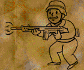

**Взаимоисключения:**  
- `Перк: Снайпер`
- `Перк: Критическое мышление`
- `Перк: Ковбой`
- `Перк: Бесшумный бег`

**Разряды:** `1`  
**Требования:**  
- `Удача: 3`
- `Макс. уровень: 29`

**Эффект:**  
- `+10% крит шанс`
- `+1 ОД при прицельном выстреле.`

---
### Хитрость
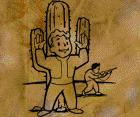

**Разряды:** `1`  
**Требования:**  
- `Трейт: Вор`
- `Ловкость: 7`
- `Удача: 3`
- `Макс. уровень: 29`

**Эффект:**  
- `+30 ОЗ.`
- `+5% к увороту.`
- `+50% к атлетизму.`

---
### Мастер
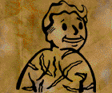

**Разряды:** `1`  
**Требования:**  
- `Ловушки: 200%`
- `Макс. уровень: 29`

**Эффект:**  
- `Боеприпасы оружия получают -5% к резисту противника.`
- `С вероятностью Удача% выстрел вызовет у противника Боль.`
- > 💡 **Примечание:** `Эффект боль: -1Од, 25% Подавления.`
- `Атаки работают на погекс (где есть заряды у оружия).`

---
### Полевой медик

**Разряды:** `1`  
**Требования:**  
- `Санитар: 120%`
- `Доктор: 100%`
- `Макс. уровень: 29`

**Эффект:**  
- `+20% к Санитару, +30% к Доктору.`
- `+3 к Удаче при лечении Санитаром.`
- > 💡 **Примечание:** `Лечение Санитаром = Случайное число от (Бонус от аптечки + (Навык / 6) + (Удача * (Навык / 12))) до (Бонус от аптечки + Навык) к которому добавляются штрафы от: трейтов, отравления и облучения и бонусы от: перков и имплантов.`
- `-2 секунды к восстановлению Санитара для вас и при лечении Санитаром по вам.`
- > 💡 **Примечание:** `Время восстановление Санитара = 40 секунд.`
- `Нет штрафа за лечение другого игрока.`

---
### Партизанская граната
> ⚠️ **Warning:** `Требуется картинка`

**Разряды:** `1`  
**Требования:**  
- `Сила: 8`
- `Метательное: 180%`
- `Макс. уровень: 29`

**Эффект:**  
- `+10 к урону от всех гранат`
- `+10 к урону ручного гранатомета`
- `C шансом (ОД на бросок гранаты) * 10% вам вернётся 1 ОД, включая ручной гранатомёт`