# Способности / Перки (28 сессия)

Способность (англ. Perk) — бонус в ролевой системе SPECIAL, предоставляемый персонажу с достижением определенного уровня (также аналогичные способности есть у некоторых единиц вооружения). Обычно скорость получения способностей для персонажей равна трём (то есть выбор будет предоставляться на каждом третьем уровне), кроме персонажей с особенностью "Умелец". По достижению 28 уровня возможен выбор только софткапных перков. Почти все способности требуют определенных свойств персонажа, таких как уровень, основные характеристики, навыки, карма и другие.  

Некоторые способности могут выбираться несколько раз.

**Список перков**

<details markdown="1">
  <summary markdown="span">Содержимое:</summary>

  - [Перки 2 уровня](#перки-2-уровня)
  - [Перки 6 уровня](#перки-6-уровня)
  - [Перки 9 уровня](#перки-9-уровня)
  - [Перки 12 уровня](#перки-12-уровня)
  - [Перки 15 уровня](#перки-15-уровня)
  - [Перки 30 уровня](#перки-30-уровня)
  - [Перки после софт капа](#перки-после-софт-капа)
  - [Мастер перки](#мастер-перки)
  - [Квестовые перки](#квестовые-перки)
  - [Функциональные перки](#функциональные-перки)

</details>

## Перки 2 уровня

### Бонус движения


**Разряды:** `1`  
**Требования:**  
- `Ловкость: 3`
- `Макс. уровень: 29`

**Эффект:**  
- `Каждые 10 секунд вы восстанавливаете 1 ОД.`

---
### Быстрая реакция


**Разряды:** `2`  
**Требования:**  
- `Восприятие: 7`
- `Макс. уровень: 29`

**Эффект:**  
- `+4 к Порядку действий.`

---
### Больше крит. атак


**Разряды:** `1`  
**Требования:**  
- `Восприятие: 6`
- `Макс. уровень: 29`

**Взаимоисключения:**  
- `Перк: Бесшумный бег`

**Эффект:**  
- `+10% к Шансу на критическую атаку.`

---
### Переноска


**Разряды:** `1`  
**Требования:**  
- `Сила: 6`
- `Выносливость: 6`
- `Макс. уровень: 29`

**Эффект:**  
- `+50% к Атлетизму.`
- `+100 к Переносимому грузу.`
- `33% шанс избежать катание от дробовиков.`

---
### Оптимизация


**Разряды:** `1`  
**Требования:**  
- `Ловкость: 5`
- `Макс. уровень: 29`

**Эффект:**  
- `-1 ОД к стоимости перезарядки.`
- `+40% шанс восстановить 1 ОД при перезарядке.`
- `25% шанс восстановить 1 ОД при использовании предмета.`

---
### Самоучка


**Разряды:** `3`  
**Требования:**  
- `Интеллект: 6`
- `Макс. уровень: 29`

**Эффект:**  
- `+15% к получаемому опыту.`
- > 💡 **Примечание:** `Перк можно получить при Рейтинге 50 и больше у АХС-9 в Сан-Франциско за 200000 монет с инвентаря.`

---
### Образование


**Разряды:** `1`  
**Требования:**  
- `Макс. уровень: 29`

**Эффект:**  
- `+50 к Очкам умений.`

---
### Наблюдательность


**Разряды:** `1`  
**Требования:**  
- `Интеллект: < 7`
- `Макс. уровень: 29`

**Эффект:**  
- `+1 к Интеллекту.`
- `Вы получаете 200 очков опыта за каждую прочитанную книгу.`

---
### Осведомленность


**Разряды:** `1`  
**Требования:**  
- `Восприятие: 5`
- `Макс. уровень: 29`

**Эффект:**  
- `Вы можете видеть ОЗ, предметы в руках и броню персонажей.`
- `При выстреле по противнику вы узнаете его % антикрита и % уворота.`

---
### Бдительность


**Разряды:** `1`  
**Требования:**  
- `Восприятие: 6`
- `Макс. уровень: 29`

**Эффект:**  
- `+3 к гексам Обзора.`
- `Вы восстанавливаете 1 ОД при промахе`

---
### Эгоист


**Разряды:** `1`  
**Требования:**  
- `Харизма: 5`
- `Макс. уровень: 29`

**Эффект:**  
- `Вы выходите из боевого режима при лечении Санитаром если вы не отравлены и не облучены.`

---
### Мастер ближнего боя


**Разряды:** `1`  
**Требования:**  
- `Ловкость: 7`
- `Макс. уровень: 29`

**Эффект:**  
- `При атаке рукопашным или холодным оружием к вашему урону добавляется рандомное значение вашей Силы.`

---
### Быстрота


**Разряды:** `1`  
**Требования:**  
- `Харизма: 5`
- `Макс. уровень: 29`

**Эффект:**  
- `+1 к ОД.`

## Перки 6 уровня

### Легкие шаги


**Разряды:** `1`  
**Требования:**  
- `Ловкость: 5`
- `Макс. уровень: 29`

**Эффект:**  
- `+5 к Трешхолду от Огня.`
- `+15% к Резисту от Взрыва.`
- `-50% к урону Ловушек по вам.`
- `50% шанс избежать активацию Ловушки.`
- > 💡 **Примечание:** `Активируемые ловушки: капканы, растяжки, мины и т.д.`
- `50% шанс избежать крит. эффекта нокдаун`

---
### Крутизна


**Разряды:** `1`  
**Требования:**  
- `Сила: 7`
- `Макс. уровень: 29`

**Эффект:**  
- `+2 ко всем трешхолдам`
- `+5% к резистам Нормы и Огня.`

---
### Отличник


**Разряды:** `1`  
**Требования:**  
- `Восприятие: 7`
- `Макс. уровень: 29`

**Эффект:**  
- `+5% к резистам от типов урона Плазма, Лазер, Электричество.`
- `Иммунитет к сжиганию ОД.`

---
### Счастливчик


**Разряды:** `1`  
**Требования:**  
- `Удача: 3`
- `Макс. уровень: 29`

**Эффект:**  
- `+(Удача) к роллу крита.`
- > 💡 **Примечание:** `Сумма ролла крита не больше 10.`
- > 💡 **Примечание:** `Крит ролл и ролл крита это разные вещи. Ролл крита это проверка на второй крит. эффект по вам при критическом попадании. Формула: Рандом(1, 10) > (SPECIAL + счастливчик), при 10 спешила шанс = 0%`
- `(Удача - Удача атакующего)% шанс что одиночная атака по вам нанесет 1 урон.`
- `(Удача)% шанс полностью восстановить ваше ОЗ и ОД при использовании Доктора.`

---
### Непоседа


**Разряды:** `1`  
**Требования:**  
- `Макс. уровень: 29`

**Эффект:**  
- `+(Сила*5) к ОЗ.`
- `Увеличение шанса на поиск уникальной локации`

---
### Бонус точности


**Разряды:** `1`  
**Требования:**  
- `Удача: 4`
- `Макс. уровень: 29`

**Эффект:**  
- `+(Количество попавших пуль+10) к урону очереди.`

---
### Двуличный


**Разряды:** `1`  
**Требования:**  
- `Харизма: 6`
- `Макс. уровень: 29`

**Эффект:**  
- `+8 к урону.`
- > 💡 **Примечание:** `Бонус к урону не работает на оружие с типом урона Огонь.`

---
### Фанат дробовиков


**Разряды:** `1`  
**Требования:**  
- `Интеллект: 6`
- `Легкое оружие: 160%`
- `Макс. уровень: 29`

**Эффект:**  
- `+30% к Легкому оружию, +20% к Ремонту.`
- `+12 к урону дробовиков.`

---
### Ярость


**Разряды:** `1`  
**Требования:**  
- `Рукопашное: 200%`
- `Макс. уровень: 29`

**Эффект:**  
- `Яростный удар валит противника на пол, добавляет 8 к урону и снимает 1 ОД.`
- > 💡 **Примечание:** `Кд удара 10 секунд, Кд общий с Ударом Вора.`

---
### Крутой парень


**Взаимоисключения:**  
- `Перк: Бесшумный бег`

**Разряды:** `1`  
**Требования:**  
- `Макс. уровень: 29`

**Эффект:**  
- `(Порядок>Рандом(0,ПорядокПротивника+100))% шанс сжечь 3 текущих ОД у цели при вашей атаке.`
- > 💡 **Примечание:** `Сжигание ОД работает на погексовые атаки.`
- `Игнорирование требования Силы на дальность атаки Метательного оружия.`
- `Игнор бонусов жертвы на срез урона при атаке в небоевом режиме.`

---
### Ковбой


**Взаимоисключения:**  
- `Трейт: Добродушие`
- `Перк: Бесшумный бег`
- `Перк: Снайпер`

**Разряды:** `1`  
**Требования:**  
- `Ловкость: 8`
- `Легкое оружие: 180%`
- `Макс. уровень: 29`

**Эффект:**  
- `При атаке пистолетом типа Легкое оружие:`
  - `Вы восстанавливаете 1 ОД если атака была прицельной.`
  - `+5% к Шансу на критическую атаку.`
  - `Ваша атака вводящая в боевой режим выбивает патроны у цели в инвентарь.`
  - > 💡 **Примечание:** `Солнечному скорчеру выбить патроны невозможно.`

---
### Человек действия


**Разряды:** `1`  
**Требования:**  
- `Ловкость: 6`
- `Макс. уровень: 29`

**Эффект:**  
- `+1 к ОД.`

---
### Быстрое лечение


**Разряды:** `1`  
**Требования:**  
- `Выносливость: 8`
- `Макс. уровень: 29`

**Эффект:**  
- `+(Харизма * 3) к Уровню лечения.`
- `-0,2 секунды к задержке на использование медикаментов и наркотиков.`
- `Вы восстанавливаете (Максимальное ОД/4) ОД при лечении Санитаром.`

---
### Полевой санитар


**Разряды:** `1`  
**Требования:**  
- `Санитар: 60%`
- `Доктор: 40%`
- `Макс. уровень: 29`

**Эффект:**  
- `-4 секунды к восстановлению Санитара.`
- > 💡 **Примечание:** `Время восстановление санитара = 40 секунд.`
- `+((Интеллект+Удача)*3) к лечению Санитаром.`
- `(Удача*2)% шанс полностью восстановить ОЗ при использовании Санитара.`

---
### Лечение


**Разряды:** `1`  
**Требования:**  
- `Санитар: 40%`
- `Макс. уровень: 29`

**Эффект:**  
- `+40 к лечению Санитаром.`
- `+20 к лечению Санитаром при ношении в дополнительном слоте сумки парамедика.`
- `+20 к лечению Санитаром другого персонажа и лечению Санитаром от другого персонажа.`
- `+5 к лечению Суперстимулятором.`

---
### Опытный медик


**Разряды:** `1`  
**Требования:**  
- `Доктор: 80%`
- `Макс. уровень: 29`

**Эффект:**  
- `При лечении санитара минимум лечения берется как среднее значение первоначального максимума и минимума лечения.`
- `При расчетах получение Раны к удаче добавляется 5.`

---
### Привидение


**Разряды:** `1`  
**Требования:**  
- `Макс. уровень: 29`

**Эффект:**  
- `+40% к Скрытности.`
- `Каждые 10 секунд вы восстанавливаете 1 ОД если вы в Скрытности.`

---
### Человек-глыба


**Разряды:** `1`  
**Требования:**  
- `Сила: 6`
- `Макс. уровень: 29`

**Эффект:**  
- `Атака по вам вводящая в боевой режим наносит в 2 раза меньше урона.`
- > 💡 **Примечание:** `Не работает на погексовые атаки.`
- `Оружие не выпадает из рук при критическом промахе или критической атаке по вам.`
- `Иммунитет к шансовому Подавлению от перка Огневая поддержка.`
- `50% шанс избежать падение.`
- > 💡 **Примечание:** `Избегание падения не работает против беретты 2050 оса`

---
### Голем


**Разряды:** `1`  
**Требования:**  
- `Харизма: 4`
- `Макс. уровень: 29`

**Эффект:**  
- `На персонаже не срабатывают растяжки и мины.`

---
### Атлет


**Разряды:** `1`  
**Требования:**  
- `Атлетизм: 50%`
- `Макс. уровень: 29`

**Эффект:**  
- `+50% к Атлетизму.`
- `-2 секунды к выходу из боевого режима.`
- > 💡 **Примечание:** `Выход из боевого режима не может быть меньше 5 секунд.`

---
### Меткость


**Разряды:** `1`  
**Требования:**  
- `Интеллект: 6`
- `Макс. уровень: 29`

**Эффект:**  
- `+2 к Восприятию если Восприятие 3 и меньше.`
- `+2 к Восприятию при расчете точности.`
- `+6 к гексам Обзора.`
- `-5% к Увороту цели.`

---
### Прицел


**Разряды:** `1`  
**Требования:**  
- `Макс. уровень: 29`

**Эффект:**  
- `+((60 - Дистанция) / 2)% к навыку при расчетах штрафа дыма.`

---
### Зоркий


**Разряды:** `1`  
**Требования:**  
- `Восприятие: 5`
- `Макс. уровень: 29`

**Эффект:**  
- `Игнорирование штрафа дыма на атаки очередью.`

---
### Верткость


**Разряды:** `1`  
**Требования:**  
- `Харизма: 2`
- `Макс. уровень: 29`

**Эффект:**  
- `+(Текущие ОД / 2)% к Увороту.`

---
### Цепной пёс
> ⚠️ **Warning:** `Требуется картинка`

**Взаимоисключения:**  
- `Трейт: Вор`

**Разряды:** `1`  
**Требования:**  
- `Интеллект: 7`
- `Ловкость: 6`
- `Рукопашное или Холодное оружие: 200`
- `Макс. уровень: 29`

**Эффект:**  
- `Если до противника меньше 16 клеток, то вы получаете (15-дистанция)% к увороту против его дистанционных атак, но не более капа уворота`


---
### Получить силу


**Разряды:** `1`  
**Требования:**  
- `Сила: < 10`
- `Макс. уровень: 29`

**Эффект:**  
- `+1 к Силе.`
- `+20 к ОЗ.`

---
### Получить восприятие


**Разряды:** `1`  
**Требования:**  
- `Восприятие: < 10`
- `Макс. уровень: 29`

**Эффект:**  
- `+1 к Восприятию.`
- `+20 к ОЗ.`

---
### Получить выносливость


**Разряды:** `1`  
**Требования:**  
- `Выносливость: < 10`
- `Макс. уровень: 29`

**Эффект:**  
- `+1 к Выносливости.`
- `+20 к ОЗ.`

---
### Получить харизму


**Разряды:** `1`  
**Требования:**  
- `Харизма: < 10`
- `Макс. уровень: 29`

**Эффект:**  
- `+1 к Харизме.`
- `+20 к ОЗ.`

---
### Получить интеллект


**Разряды:** `1`  
**Требования:**  
- `Интеллект: < 10`
- `Макс. уровень: 29`

**Эффект:**  
- `+1 к Интеллекту.`
- `+20 к ОЗ.`

---
### Получить ловкость


**Разряды:** `1`  
**Требования:**  
- `Ловкость: < 10`
- `Макс. уровень: 29`

**Эффект:**  
- `+1 к Ловкости.`
- `+20 к ОЗ.`

---
### Получить удачу


**Разряды:** `1`  
**Требования:**  
- `Удача: < 10`
- `Макс. уровень: 29`

**Эффект:**  
- `+1 к Удаче.`
- `+20 к ОЗ.`

## Перки 9 уровня

### Лучшие крит. атаки


**Разряды:** `1`  
**Требования:**  
- `Восприятие: 6`
- `Ловкость: 4`
- `Макс. уровень: 29`

**Эффект:**  
- `+20 к критическому роллу.`

---
### Ящерица


**Разряды:** `1`  
**Требования:**  
- `Сила: 7`
- `Макс. уровень: 29`

**Эффект:**  
- `50% шанс восстановить (Сила*2) ОЗ если атака по вам 65 урона и больше.`

---
### Пироманьяк


**Разряды:** `1`  
**Требования:**  
- `Интеллект: 4`
- `Макс. уровень: 29`

**Эффект:**  
- `+50% к защите от тиков огня`
- `+20 к урону для оружия с типом урона Огонь.`
- `+15 к тикам Огня.`
- > 💡 **Примечание:** `Тики огня не работают на персонажей с трейтом Жидкое тело и на персонажей в боевой броне Анклава, огнеупорной броне или моторизованной броне.`
- > 💡 **Примечание:** `Моторизованная броня: cиловая броня, закаленная силовая броня, улучш. силовая броня, улучш. силовая броня мод. II, РБК и РБК II.`
- > 💡 **Примечание:** `Урон тика огня при прямом нанесении урона огнем = (10 + (Пироманьяк * 15) + (Мастер огня * 2)).`
- > 💡 **Примечание:** `Урон тика огня при ходьбе по гексу с огнем = (5 + (Пироманьяк * 10) + (Мастер огня * 2)).`

---
### Мастер


**Разряды:** `1`  
**Требования:**  
- `Ловушки: 200%`
- `Макс. уровень: 29`

**Эффект:**  
- `Боеприпасы оружия получают -5% к резисту противника.`
- `С вероятностью Удача% выстрел вызовет у противника Боль.`
- > 💡 **Примечание:** `Эффект боль: -1Од, 25% Подавления.`
- `Атаки работают на погекс (где есть заряды у оружия).`

---
### Партизанская граната
> ⚠️ **Warning:** `Требуется картинка`

**Разряды:** `1`  
**Требования:**  
- `Сила: 8`
- `Метательное: 180%`
- `Макс. уровень: 29`

**Эффект:**  
- `+10 к урону от всех гранат`
- `+10 к урону ручного гранатомета`
- `C шансом (ОД на бросок гранаты) * 10% вам вернётся 1 ОД, включая ручной гранатомёт`

---
### Токсиколог


**Разряды:** `1`  
**Требования:**  
- `Наука: 180%`
- `Макс. уровень: 29`

**Эффект:**  
- `Иммунитет к контактному отравлению.`
- > 💡 **Примечание:** `Контактное отравление то - которое действует на вас через удары или выстрелы`
- `+(10-(Выносливость цели/2)) к урону по НПС.`
- `При атаке одиночным выстрелом оружием с типом норма вы отравляете цель на 20 уровней отравления и если Устойчивость к яду у цели выше 75%, то расчет будет как при 75%.`
- `При броске газовой гранаты в гексе попадания образуется токсичная лужа, которая травит если по ней пройти.`
- > 💡 **Примечание:** `НПС не могут быть отравлены, только игроки.`
- > 💡 **Примечание:** `При отравлении входящий уровень отравления уменьшаются на (Устойчивость к яду)%.`

---
### Огневая поддержка


**Разряды:** `1`  
**Требования:**  
- `Восприятие: 7`
- `Ловкость: 7`
- `Метательное оружие: 100%`
- `Макс. уровень: 29`

**Эффект:**  
- `+20% к Метательному оружию.`
- `+1 к гексам действия для дымовой гранаты и гранаты с горчичным газом.`
- `Дым и горчичный газ распространяется за 2 секунды.`
- `Вы подавляете цель при:`
  - `Одиночной атаке оружием с типом боеприпасов дробь (кроме панкора джекхаммера) при дистанции от 3 до 15 гексов.`
  - `Одиночной атаке Легким оружием с перком Дальнобойное при дистанции 24 гекса и больше.`
  - `Атаке очередью из Легкого оружия с типом боеприпасов дробь и Тяжелого оружия при дистанции 3 гекса и больше.`
- > 💡 **Примечание:** `Подавление от перка не работает на персонажей с трейтом Камикадзе и на персонажей в моторизованной броне.`
- > 💡 **Примечание:** ` Моторизованная броня: cиловая броня, закаленная силовая броня, улучш. силовая броня, улучш. силовая броня мод. II, РБК и РБК II.`
- `50% шанс подавить цель на 1% при одиночной атаке.`
- > 💡 **Примечание:** `Не работает на погексовые атаки.`
- > 💡 **Примечание:** `Шансовое Подавление от перка не работает на персонажей с трейтом Камикадзе, с перком Человек-глыба или Офицер и на персонажей в моторизованной броне.`
- `-10% к точности по вам если вы находитесь в укрытии.`

---
### Вор-профессионал


**Разряды:** `1`  
**Требования:**  
- `Взлом замков: 150%`
- `Макс. уровень: 29`

**Эффект:**  
- `+40% к Взлому замков и Воровству.`
- `Отмычки не ломаются при взломе и не требуют Ловкость и Интеллект для снижения сложности замка.`
- `Вы можете открывать контейнеры монтировкой если Взлом замков 200% и больше.`
- `Время восстановление ОЗ от Уровня лечения становиться каждые 10 секунд если вы в Скрытности.`

---
### Глаза и уши


**Разряды:** `1`  
**Требования:**  
- `Макс. уровень: 29`

**Эффект:**  
- `+2 к Восприятию.`

---
### Прыгучесть


**Разряды:** `1`  
**Требования:**  
- `Ловкость: 5`
- `Макс. уровень: 29`

**Эффект:**  
- `+1 к ОД.`
- `Быстрое восстановление из Нокаута и Нокдауна.`
- > 💡 **Примечание:** `Нокдаун = (Текущие ОД-6 ОД), с перком Прыгучесть = (Текущие ОД-3 ОД).`

---
### Прищур


**Взаимоисключения:**  
- `Перк: Снайпер`
- `Перк: Критическое мышление`
- `Перк: Ковбой`
- `Перк: Бесшумный бег`

**Разряды:** `1`  
**Требования:**  
- `Удача: 3`
- `Макс. уровень: 29`

**Эффект:**  
- `+10% крит шанс`
- `+1 ОД при прицельном выстреле.`

---
### Увертливость


**Разряды:** `1`  
**Требования:**  
- `Удача: 3`
- `Макс. уровень: 29`

**Эффект:**  
- `+10% к Увороту.`

---
### Хитрость


**Разряды:** `1`  
**Требования:**  
- `Трейт: Вор`
- `Ловкость: 7`
- `Удача: 3`
- `Макс. уровень: 29`

**Эффект:**  
- `+30 ОЗ.`
- `+5% к увороту.`
- `+50% к атлетизму.`

---
### Полевой медик


**Разряды:** `1`  
**Требования:**  
- `Санитар: 120%`
- `Доктор: 100%`
- `Макс. уровень: 29`

**Эффект:**  
- `+20% к Санитару, +30% к Доктору.`
- `+3 к Удаче при лечении Санитаром.`
- > 💡 **Примечание:** `Лечение Санитаром = Случайное число от (Бонус от аптечки + (Навык / 6) + (Удача * (Навык / 12))) до (Бонус от аптечки + Навык) к которому добавляются штрафы от: трейтов, отравления и облучения и бонусы от: перков и имплантов.`
- `-2 секунды к восстановлению Санитара для вас и при лечении Санитаром по вам.`
- > 💡 **Примечание:** `Время восстановление Санитара = 40 секунд.`
- `Нет штрафа за лечение другого игрока.`

## Перки 12 уровня

### Воодушевление
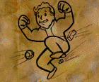

**Разряды:** `1`  
**Требования:**  
- `Перк: Увертливость`
- `Макс. уровень: 29`

**Эффект:**  
- `+(Ловкость * 2)% к Увороту.`
- > 💡 **Примечание:** `Ловкость от наркотиков идёт в расчет формулы этого перка.`
- `Вы восстанавливаете 1 ОД при Увороте.`
- `Антикрит 100% если ОЗ меньше (Максимальное ОЗ/3).`

---
### Удачный промах
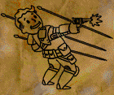

**Разряды:** `1`  
**Требования:**  
- `Восприятие: 6`
- `Удача: 2`
- `Макс. уровень: 29`

**Эффект:**  
- `+1 к ОД.`
- `(Удача)% шанс восстановить (Точность атакующего/10) ОД при промахе по вам.`
- `Если шанс не выпал вы восстановите 1 ОД.`

---
### Броня
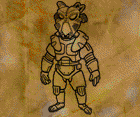

**Взаимоисключения:**  
- `Перк: Сила жизни`

**Разряды:** `1`  
**Требования:**  
- `Трейт: Химик`
- `Макс. уровень: 29`

**Эффект:**  
- `+60 к ОЗ.`
- `-5 ко всем тикам, включая яд.`

---
### Спортсмен
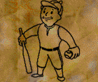

**Разряды:** `1`  
**Требования:**  
- `Сила: 8`
- `Макс. уровень: 29`

**Эффект:**  
- `+40 к ОЗ.`
- `+10 к КБ.`

---
### Ветеран
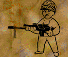

**Разряды:** `1`  
**Требования:**  
- `Удача: 2`
- `Макс. уровень: 29`

**Эффект:**  
- `+30 к ОЗ.`
- `+10 к КБ при расчетах по вам.`
- `Игнорирование штрафа на прицельные атаки.`
- > 💡 **Примечание:** `Штраф на прицельные атаки: глаза = (Навык-50)%, голова = (Навык-40)%, руки = (Навык-20)%, пах = (Навык-30)% и ноги = (Навык-20)%.`
- `При атаке вы добавляете (Удача*6) секунд Усталости у цели.`
- > 💡 **Примечание:** `При Усталости 30 минут и больше вы не можете: ремонтировать оружие в руке (первом слоте) и броню при использовании Ремонта на другого игрока при наличии перка Боевой инженер, получать опыт за удачное нахождение случайных локаций на Глобальной карте и использовать Санитара и Доктора.`

---
### Мутация
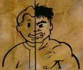

**Разряды:** `1`  
**Требования:**  
- `Сила: 3`
- `Выносливость: 5`
- `Макс. уровень: 29`

**Эффект:**  
- `+20 к ОЗ.`
- `+100 к Очкам умений.`

---
### Кровопийца
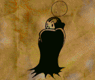

**Разряды:** `1`  
**Требования:**  
- `Выносливость: 7`
- `Санитар: 200`
- `Макс. уровень: 29`

**Эффект:**  
- `+20 к ОЗ.`
- `Вы восстанавливаете (Восприятие*2) ОЗ при атаке.`
- `Вы снимаете Нагрев при лечении Санитаром.`

---
### Живчик
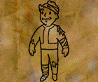

**Разряды:** `1`  
**Требования:**  
- `Выносливость: 6`
- `Макс. уровень: 29`

**Эффект:**  
- `+40 к ОЗ.`
- `+(Харизма * 3) к Уровню лечения.`

---
### Регенерация
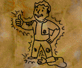

**Разряды:** `1`  
**Требования:**  
- `Харизма: 5`
- `Интеллект: 6`
- `Макс. уровень: 29`

**Эффект:**  
- `+25 к уровню лечения`
- `Восстановление ОЗ от Уровня лечения становится полноценным.`
- > 💡 **Примечание:** `Без перка восстановление ОЗ от Уровня лечения = (Уровень лечения / 2).`
- `Каждые 10 секунд вне боя лечит конечности.`
- > 💡 **Примечание:** `Шанс вылечить конечности зависит от Доктора. Формула Рандом(0, 300) < Доктор`

---
### Крепкий орешек


**Разряды:** `1`  
**Требования:**  
- `Макс. уровень: 29`

**Эффект:**  
- `-(Сила + (Восприятие * 3)) к критическому роллу по вам.`
- `Критический урон по вам уменьшается на -(1.5 * Удача + 1.25 * Сила + Интеллект)% .`
- > 💡 **Примечание:** `Уменьшенный критический урон от Удачи = ((Урон * 200 - Урон* (Удача * 1.25)) / 100).`
- > 💡 **Примечание:** `Критический урон от Рукопашной и Холодного оружия не уменьшается от Удачи.`
- `Уменьшенный бонусный урон от Пропуска хода и Нокаута по вам.`
- > 💡 **Примечание:** `Пропуск хода = (Урон + 10%), с перком Крепкий орешек = (Урон + 5%).`
- > 💡 **Примечание:** `Нокаут = (Урон + 20%), с перком Крепкий орешек = (Урон + 10%).`

---
### Иммунитет
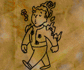

**Разряды:** `1`  
**Требования:**  
- `Сила: 6`
- `Интеллект: 8`
- `Макс. уровень: 29`

**Эффект:**  
- `-(Сила) к урону по вам.`

---
### Пробивающий удар
> ⚠️ **Warning:** `Требуется картинка`

**Взаимоисключения:**  
- `Трейт: Вор`
- `Перк: Дробила`

**Разряды:** `1`  
**Требования:**  
- `Сила: 10`
- `Холодное оружие: 120`
- `Макс. уровень: 29`

**Эффект:**  
- `Атаки рукопашным и холодным оружием получают к конечному урону 1/3 резиста цели.`
- > 💡 **Примечание:** `Пример: Удар наносит 70 урона, резист цели 50%. 50 * 1/3 = 17. 70 + 17 = 87`

---
### Рефлексы
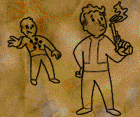

**Взаимоисключения:**  
- `Трейт: Быстрый стрелок`
- `Перк: Снайпер`

**Разряды:** `1`  
**Требования:**  
- `Восприятие: 5`
- `Выносливость: 8`
- `Макс. уровень: 29`

**Эффект:**  
- `-1 ОД к стоимости неприцельных атак для Легкого оружия, Тяжелого оружия, Энергооружия и Метательного оружия.`
- > 💡 **Примечание:** `Уменьшение стоимости неприцельных атак не работает на Инженерное оружие и погекосвые атаки.`
- > 💡 **Примечание:** `Погексовые атаки: двухзарядный гранатомет, ручной гранатомет м32 "milkor", осколочная граната, плазменная граната, импульсная граната, коктейль Молотова, дымовая граната, граната с горчичным газом, светозвуковая граната, святая граната и миномет.`

---
### Дополнительные атаки
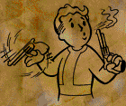

**Разряды:** `1`  
**Требования:**  
- `Интеллект: 7`
- `Ловкость: 7`
- `Макс. уровень: 29`

**Эффект:**  
- `(25+(Стоимость ОД на атаку*10))% шанс восстановить 1 ОД при атаке Легким оружием, Тяжелым оружием, Энергооружием, Метательным оружием и Инженерным оружием.`
- > 💡 **Примечание:** `Перк работает на погексовые атаки`
- > 💡 **Примечание:** `Перк не работает на Рукопашную и Холодное оружие.`

---
### Взрывотехник
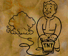

**Разряды:** `1`  
**Требования:**  
- `Удача: 5`
- `Ловушки: 200%`
- `Наука: 150%`
- `Макс. уровень: 29`

**Эффект:**  
- `Скрытность ваших Ловушек как при 300% Ловушек.`
- `-0,4 секунды к задержке на использование полевого переключателя.`
- `Вы можете крафтить робота-шахида.`
- > 💡 **Примечание:** `Крафт робота-шахида: детали робота в первый слот + пластиковая взрывчатка в второй слот и использовать Науку на детали робота.`
- > 💡 **Примечание:** `Максимальное количество роботов-шахидов = 3.`
- > 💡 **Примечание:** `Робот-шахид не управляется пультом, он летит взрываться в цель вашей атаки.`
- > 💡 **Примечание:** `Робота-шахида можно разобрать Наукой.`
- > 💡 **Примечание:** `Робот-шахид самоуничтожается через 10 минут существования.`

---
### Боевой инженер
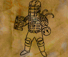

**Разряды:** `1`  
**Требования:**  
- `Восприятие: 6`
- `Интеллект: 6`
- `Ловкость: 3`
- `Ремонт: 180%`
- `Макс. уровень: 29`

**Эффект:**  
- `+20% к Ремонту.`
- `Инженерное оружие наносит полный урон`
- > 💡 **Примечание:** `Без перка Инженерное оружие наносит в 2 раза меньше урона.`
- `Вы можете ремонтировать оружие в руке (первом слоте) и броню при использовании Ремонта на другого игрока.`
- `Вы можете ставить специальные инженерные укрепления`

---
### Математик
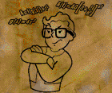

**Разряды:** `1`  
**Требования:**  
- `Интеллект : 7`
- `Удача : 2`
- `Наука: 200%`
- `Макс. уровень: 29`

**Эффект:**  
- `+30% к навыку при расчете точности.`
- `+10% к навыку при расчетах штрафа дыма для вас и -10% к навыку при расчетах штрафа дыма по вам.`
- `+10% к точности против цели в укрытии для вас и -10% к точности по вам если вы находитесь в укрытии.`

> 💡 **Примечание:** `Штраф дыма:`
```
Дистанция больше 5 гексов:
- Из дыма в дым = 80
- Из дыма в цель = 50
- По цели в дыму = 30
Дистанция 5 гексов и меньше гексов:
- Из дыма в дым = 40
- Из дыма в цель = 35
- По цели в дыму = 30
```

---
### Старый вояка
> ⚠️ **Warning:** `Требуется картинка`

**Взаимоисключения:**  
- `Перк: Терминатор`

**Разряды:** `1`  
**Требования:**  
- `Макс. уровень: 29`

**Эффект:**  
- `+20% к антикриту.`

---
### Боевой аналитик
> ⚠️ **Warning:** `Требуется картинка`

**Разряды:** `1`  
**Требования:**  
- `Восприятие: 7`
- `Наука: 200`
- `Макс. уровень: 29`

**Эффект:**  
- `При стрельбе из базук (включая шайтанки) радиус взрыва боеприпаса увеличивается на 2 гекса.`

## Перки 15 уровня

### Терминатор (Уберперк)


**Взаимоисключения:**  
- `Трейт: Добродушие`
- `Трейт: Умелец`
- `Перк: Бесшумный бег`
- `Перк: Неудержимый`
- `Перк: Снайпер`
- `Перк: Старый вояка`

**Разряды:** `1`  
**Требования:**  
- `Макс. уровень: 29`

**Эффект:**  
- `Ваш антикрит высчитывается по формуле ( СИЛ + ВЫН ) * 5`
- > 💡 **Примечание:** `Ваш базовый антикрит не учитывается`
- > 💡 **Примечание:** `Базовый Антикрит персонажей = (Сила*2)%.`
- `КД санитара вычисляется по формуле 7500/навык`
- `Шанс вылечить свою сломанную конечность = 100% вне зависимости от вашего навыка доктора`

---
### Неудержимый (Уберперк)
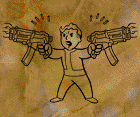

**Взаимоисключения:**  
- `Трейт: Добродушие`
- `Трейт: Умелец`
- `Перк: Бесшумный бег`
- `Перк: Снайпер`
- `Перк: Терминатор`

**Разряды:** `1`  
**Требования:**  
- `Ловкость: 8`
- `Макс. уровень: 29`

**Эффект:**  
- `+((Ловкость / 2) - 1) к ОД.`
- `Вы восстанавливаете ОД на 7% быстрее.`
- `Вы можете атаковать с двуручного оружия если у вас сломана рука.`


---
### Снайпер (Уберперк)
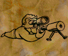

**Взаимоисключения:**  
- `Трейт: Добродушие`
- `Трейт: Умелец`
- `Перк: Ковбой`
- `Перк: Рефлексы`
- `Перк: Бесшумный бег`
- `Перк: Неудержимый`
- `Перк: Терминатор`
- `Перк: Прищур`
- `Перк: Критическое мышление`

**Разряды:** `1`  
**Требования:**  
- `Макс. уровень: 29`

**Эффект:**  
- `+40% к Шансу на критическую атаку.`
- `-1 ОД к стоимости прицельных атак для Легкого оружия, Тяжелого оружия, Энергооружия и Инженерного оружия.`
- `Ваша атака вводящая в боевой режим имеет 100% шанс попадания если навык больше 100%.`
- > 💡 **Примечание:** `Цель может увернуться от вашей атаки.`

---
### Бесшумный бег (Уберперк)
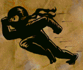

**Взаимоисключения:**  
- `Трейт: Вор`
- `Трейт: Добродушный`
- `Трейт: Умелец`
- `Перк: Снайпер`
- `Перк: Неудержимый`
- `Перк: Терминатор`
- `Перк: Больше критических атак`
- `Перк: Лучшие критические атаки`
- `Перк: Критическое мышление`
- `Перк: Прищур`
- `Перк: Крутой парень`
- `Перк: Концентрация`
- `Перк: Ковбой`
- `Перк: Авторитет`

**Разряды:** `1`  
**Требования:**  
- `Восприятие: 10`
- `Макс. уровень: 29`


**Эффект:**  
- `Вы можете бегать в Скрытности.`
- > 💡 **Примечание:** `Без перка вы выходите из Скрытности при беге.`

---
### Дробила
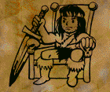

**Взаимоисключения:**  
- `Трейт: Добродушие`
- `Перк: Пробивающий удар`

**Разряды:** `1`  
**Требования:**  
- `Сила: 7`
- `Ловкость: 6`
- `Рукопашное: 100%`
- `Макс. уровень: 29`

**Эффект:**  
- `+10% к антикриту.`
- `100% шанс на критическую атаку для Рукопашной и Холодного оружия.`
- > 💡 **Примечание:** `Критический урон для Рукопашной и Холодного оружия = (Урон*1.33), а не (Урон*2).`
- > 💡 **Примечание:** `Критические эффекты для Рукопашной и Холодного оружия отличаются от критических эффектов для для Легкого оружия, Тяжелого оружия, Энергооружия и Инженерного оружия.`
- > 💡 **Примечание:** `Критический урон от Рукопашной и Холодного оружия не уменьшается от Удачи.`

---
### Доп. рукопашн. атаки
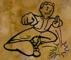

**Разряды:** `1`  
**Требования:**  
- `Ловкость: 6`
- `Макс. уровень: 29`

**Эффект:**  
- `-1 ОД к стоимости атак для Рукопашной и Холодному оружию.`

---
### Бонус скорости
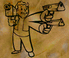

**Разряды:** `1`  
**Требования:**  
- `Восприятие: 6`
- `Интеллект: 6`
- `Ловкость: 7`
- `Макс. уровень: 29`

**Эффект:**  
- `-1 ОД к стоимости неприцельных атак для Легкого оружия, Тяжелого оружия, Энергооружия и Метательного оружия.`
- > 💡 **Примечание:** `Уменьшение стоимости атак не работает на Инженерное оружие.`

---
### Концентрация
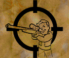

**Взаимоисключения:**  
- `Перк: Бесшумный бег`

**Разряды:** `1`  
**Требования:**  
- `Удача: 3`
- `Макс. уровень: 29`

**Эффект:**  
- `-1 ОД к стоимости прицельных атак для Легкого оружия, Тяжелого оружия, Энергооружия и Метательного оружия.`
- > 💡 **Примечание:** `Уменьшение стоимости атак не работает на Инженерное оружие.`

---
### Сила жизни


**Взаимоисключения:**  
- `Перк: Броня`

**Разряды:** `1`  
**Требования:**  
- `Выносливость: 4`
- `Макс. уровень: 29`

**Эффект:**  
- `+60 к ОЗ.`

---
### Авторитет
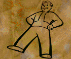

**Взаимоисключения:**  
- `Перк: Бесшумный бег`

**Разряды:** `1`  
**Требования:**  
- `Макс. уровень: 29`

**Эффект:**  
- `Если нанести урон взрывом, а потом выпустить урон очередью с 1-3 гексов, то цель получит эффект Ошарашен (с вероятностью ( 11 + Удача - УдачаЦели ) * 3% ).`
- > 💡 **Примечание:** `В эффекте Ошарашен персонаж не может применять предметы и стрелять (включается Паника), только навыки. В этом эффекте любой входящий урон увеличен на 25%. Эффект проходит через количество секунд равное Удаче атакующего.`

---
### Анатомия жизни
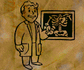

**Разряды:** `1`  
**Требования:**  
- `Восприятие: 7`
- `Доктор: 80%`
- `Макс. уровень: 29`

**Эффект:**  
- `+20% к Доктору.`
- `+10 к урону.`
- > 💡 **Примечание:** `Бонус к урону не работает на оружие с типом урона Огонь и против инопланетян и роботов.`

---
### Военврач
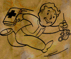

**Разряды:** `1`  
**Требования:**  
- `Интеллект: 10`
- `Доктор: 230%`
- `Макс. уровень: 29`

**Эффект:**  
- `Лечение Санитаром как при 10 Удачи.`
- `С шансом (Харизма - Харизма противника) вешает эффект Вялость при атаке (только одиночным выстрелом или ударом).`
- > 💡 **Примечание:** `Эффект вялость: вы не можете получать ХП из абсолютно любых источников.`

---
### Реаниматор
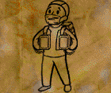

**Разряды:** `1`  
**Требования:**  
- `Доктор: 200%`
- `Макс. уровень: 29`

**Эффект:**  
- `Вы восстанавливаете 5 ОЗ при каждом изменении ОЗ.`
- > 💡 **Примечание:** `Восстановление ОЗ при любом изменений ОЗ, например: лечение санитаром, лечение суперстимуляторами, отравлении, получение урона от оружия, тиков Огня или Плазмы и т.д.`

---
### Кабан
> ⚠️ **Warning:** `Требуется картинка`

**Разряды:** `1`  
**Требования:**  
- `Сила: 8`
- `Выносливость: 8`
- `Макс. уровень: 29`

**Эффект:**  
- `Если на дистанции менее 15 гексов от цели по вам проходит более одного выстрела в секунду, урон по вам срезается на 15%`

---
### Офицер
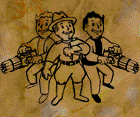

**Разряды:** `1`  
**Требования:**  
- `Восприятие: 7`
- `Интеллект: 7`
- `Скиталец: 100%`
- `Макс. уровень: 29`

**Эффект:**  
- `+30 к ОЗ.`
- `Иммунитет к шансовому Подавлению от перка Огневая поддержка.`
- `Вместо Харизмы используется Выносливость при расчете размера группы.`
- > 💡 **Примечание:** `Работает только на персонажей от 27 и с прокаченным навыком Легкое оружие, Тяжелое оружие, Энергооружие или Метательное оружие от 150%.`
- `Последняя атакованная вами цель окрашивается в контур розового цвета для вас и персонажей из вашей группы.`
- `Вы и персонажи из вашей группы с такой же фракцией у вас получаете:`
  - `В 2 раза меньше очков подавления.`
  - `+5% к точности. Примечание: Точность не может быть выше 95%.`
  - `-5% точности противника по вам.`
- > 💡 **Примечание:** `Бонусы от перка не плюсуется между собой с другими персонажами с перком Офицер`
- > 💡 **Примечание:** `Бонусы от перка не распространяются на дружественные фракции.`

---
### Критическое мышление
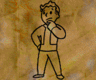

**Взаимоисключения:**  
- `Перк: Снайпер`
- `Перк: Бесшумный бег`

**Разряды:** `1`  
**Требования:**  
- `Макс. уровень: 29`

**Эффект:**  
- `Каждый выстрел увеличивает на 10% критшанс, но не больше 30%. После выпадении крита он обнуляется.`

## Перки 30 уровня

### Бывалый
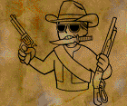

**Разряды:** `1`  
**Требования:**  
- `Интеллект: 6`
- `Макс. уровень: 32`

**Эффект:**  
- `+7% к ЛО, ЭО, ТО, рукопашке, холодному и метательному.`

---
### Самоделкин


**Разряды:** `1`  
**Требования:**  
- `Наука: 40%`
- `Ремонт: 40%`
- `Уровень: 2`
- `Макс. уровень: 32`

**Эффект:**  
- `+20% к Науке, +10% к Ремонту.`
- `Вы можете видеть износ и количество поломок у предметов.`

---
### Медик
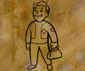

**Разряды:** `1`  
**Требования:**  
- `Санитар: 40%`
- `Доктор: 40%`
- `Уровень: 2`
- `Макс. уровень: 32`

**Эффект:**  
- `+10% к Санитару и Доктору.`

---
### Следопыт
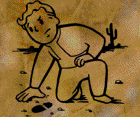

**Разряды:** `1`  
**Требования:**  
- `Выносливость: 6`
- `Скиталец: 40%`
- `Уровень: 2`
- `Макс. уровень: 32`

**Эффект:**  
- `+25% к скорости передвижения по Глобальной Карте.`
- > 💡 **Примечание:** `Перк можно получить при Красноречии 150% и больше у АХС-7 в Сан-Франциско за 50000 монет с инвентаря.`
- > 💡 **Примечание:** `Перк не работает с сенсором движения, приоритет на сенсоре (20%)`

---
### Репликант
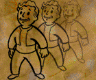

**Разряды:** `1`  
**Требования:**  
- `Сила: 4`
- `Уровень: 9`
- `Макс. уровень: 32`

**Эффект:**  
- `Репликация становится бесплатной.`

---
### Вор
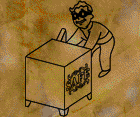

**Разряды:** `1`  
**Требования:**  
- `Уровень: 2`
- `Макс. уровень: 32`

**Эффект:**  
- `+10% к Скрытности, +25% к Взлому замков, Воровству и Ловушкам.`

---
### Обращение с оружием
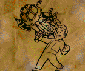

**Разряды:** `1`  
**Требования:**  
- `Ловкость: 5`
- `Уровень: 2`
- `Макс. уровень: 32`

**Эффект:**  
- `+3 к Силе при расчете силы для использования оружия.`

## Перки после Софт капа

### Зарядка
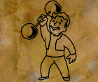

**Взаимоисключения:**  
- `Перк: Закалка`

**Разряды:** `1`  
**Требования:**  
- `Уровень: 32`
- `Макс. уровень: 99`

**Эффект:**  
- `+5 к ОЗ.`

---
### Закалка


**Взаимоисключения:**  
- `Перк: Зарядка`

**Разряды:** `1`  
**Требования:**  
- `Уровень: 32`
- `Макс. уровень: 99`

**Эффект:**  
- `+6 к Уровню лечения.`

---
### Запаковка


**Разряды:** `1`  
**Требования:**  
- `Уровень: 32`
- `Макс. уровень: 99`

**Эффект:**  
- `+22 к Переносимому грузу.`

---
### Доп. рукопашн. повр.
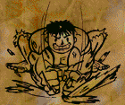

**Разряды:** `3`  
**Требования:**  
- `Сила: 6`
- `Ловкость: 6`
- `Уровень: 32`
- `Макс. уровень: 99`

**Эффект:**  
- `+3 к Рукопашным повреждениям.`

---
### Змееглот
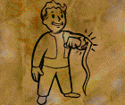

**Разряды:** `2`  
**Требования:**  
- `Выносливость: 3`
- `Уровень: 32`
- `Макс. уровень: 99`

**Эффект:**  
- `+10 к Устойчивости к яду.`
- > 💡 **Примечание:** ` При наличии трейта Быстрый метаболизм бонус будет в 2 раза меньше.`

---
### Уст. к радиации
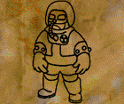

**Разряды:** `2`  
**Требования:**  
- `Выносливость: 6`
- `Интеллект: 4`
- `Уровень: 32`
- `Макс. уровень: 99`

**Эффект:**  
- `+10 к Устойчивости к радиации.`
- > 💡 **Примечание:** `При наличии трейта Быстрый метаболизм бонус будет в 2 раза меньше.`

---
### Рейнджер
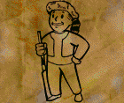

**Разряды:** `1`  
**Требования:**  
- `Восприятие: 6`
- `Уровень: 32`
- `Макс. уровень: 99`

**Эффект:**  
- `+15% к Скитальцу.`
- > 💡 **Примечание:** `Чем больше Скиталец, тем меньше опыта будет даваться за удачное нахождение случайных локаций.`
- `Увеличение шанса на поиск уникальной локации.`

---
### Исследователь
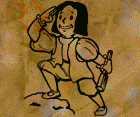

**Разряды:** `3`  
**Требования:**  
- `Выносливость: 6`
- `Интеллект: 6`
- `Скиталец: 40%`
- `Уровень: 32`
- `Макс. уровень: 99`

**Эффект:**  
- `+10% к Скитальцу.`
- > 💡 **Примечание:** `Чем больше Скиталец, тем меньше опыта будет даваться за удачное нахождение случайных локаций.`

---
### Скаут
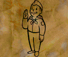

**Разряды:** `1`  
**Требования:**  
- `Выносливость: 8`
- `Уровень: 32`
- `Макс. уровень: 99`

**Эффект:**  
- `+1 к открытию клеток на Глобальной Карте.`
- `Увеличение радиуса Трекинга.`
- `Увеличение шанса на поиск уникальной локации.`

---
### Продажа


**Разряды:** `1`  
**Требования:**  
- `Опыт торговли: 240`
- `Уровень: 32`
- `Макс. уровень: 99`

**Эффект:**  
- `+40% к Торговле.`
- `+40 к Опыту торговли.`

---
### Негоциант
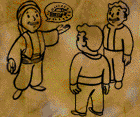

**Разряды:** `1`  
**Требования:**  
- `Опыт торговли: 200`
- `Уровень: 32`
- `Макс. уровень: 99`

**Эффект:**  
- `+20% к Красноречию и Торговле.`
- `+20 к Опыту торговли.`

---
### Торговля
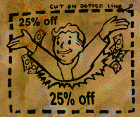

**Разряды:** `1`  
**Требования:**  
- `Опыт торговли: 200`
- `Уровень: 32`
- `Макс. уровень: 99`

**Эффект:**  
- `-25% к стоимости предметов у НПС.`
- > 💡 **Примечание:** `На самом деле дает меньше (нужно уточнить)`

---
### Болтливость
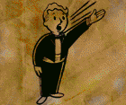

**Разряды:** `1`  
**Требования:**  
- `Интеллект: 4`
- `Уровень: 32`
- `Макс. уровень: 99`

**Эффект:**  
- `+10% к Красноречию.`

---
### Привлекательность


**Разряды:** `1`  
**Требования:**  
- `Харизма: < 10`
- `Уровень: 32`
- `Макс. уровень: 99`

**Эффект:**  
- `+2 к максимальному размеру группы.`
- > 💡 **Примечание:** `Максимальный размер группы = (Харизма), с перком Привлекательность = (Харизма+2).`
- > 💡 **Примечание:** `Максимальный размер группы с перком Офицер = (Выносливость), с перком Офицер и Привлекательность = (Выносливость+2).`

---
### Безвредность
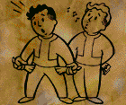

**Разряды:** `1`  
**Требования:**  
- `Воровство: 50%`
- `Карма: 50`
- `Уровень: 32`
- `Макс. уровень: 99`

**Эффект:**  
- `+40% к Воровству.`

---
### Карманник
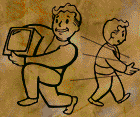

**Разряды:** `1`  
**Требования:**  
- `Ловкость: 8`
- `Воровство: 80%`
- `Уровень: 32`
- `Макс. уровень: 99`

**Эффект:**  
- `При Воровстве игнорируется направление взгляда обворовываемого персонажа если он не смотрит прямо на вас.`
- `При Воровстве игнорируется вес и объем предмета.`
- > 💡 **Примечание:** `Не влияет на количество воруемого предмета и на номер попытки Воровства.`

---
### Эксперт подрывник
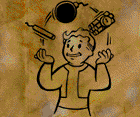

**Разряды:** `1`  
**Требования:**  
- `Ловкость: 4`
- `Ловушки: 75%`
- `Уровень: 33`
- `Макс. уровень: 99`

**Эффект:**  
- `+1 к гексам действия для: динамита, мин, пластиковой взрывчатки, сигнальных ловушек и растяжек.`
- > 💡 **Примечание:** `Типы мин: плазменная мина, мина, противопехотная мина, импульсная мина и светошумовая мина.`
- > 💡 **Примечание:** `Типы сигнальных ловушек: сигнальная ловушка и сигнальная ловушка с пластидом.`
- > 💡 **Примечание:** `Типы растяжек: растяжка (огонь), растяжка (плазма), растяжка (оскол.), растяжка (импульс), растяжка (дым), растяжка (газ) и растяжка (ослепл.).`
- `+25% к урону для капканов.`
- > 💡 **Примечание:** `Типы капканов: медвежий капкан и дробящий капкан.`
- `+50% к урону для сигнальной ловушки с пластидом и растяжек.`

---
### Специалист


**Разряды:** `15`  
**Требования:**  
- `Уровень: 32`
- `Макс. уровень: 99`

**Эффект:**  
- `+1 к Очкам умений.`

---
### Карман
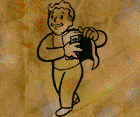

**Разряды:** `15`  
**Требования:**  
- `Уровень: 32`
- `Макс. уровень: 99`

**Эффект:**  
- `+1 к Переносимому грузу.`

---
### Золотые руки
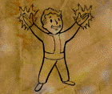

**Разряды:** `1`  
**Требования:**  
- `Сила: 8`
- `Интеллект: 8`
- `Наука: 160%`
- `Ремонт: 160%`
- `Уровень: 32`
- `Макс. уровень: 99`

**Эффект:**  
- `Добавляет крафт:`
  - `Треноги турели.`
  - `Пульта.`
  - `Робота-разведчика.`
  - `Пульта управления роботом.`
- `+30 к расчету характеристик треноги турели и робота-разведчика.`
- `Характеристики, трейты и перки треноги турели и робота-разведчика зависят от формулы (150+(Наука/2)+30*Золотые руки). Чем больше число, тем лучше будут характеристики, трейты и перки.`

## Мастер перки

### Мастер урона
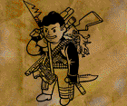

**Разряды:** `5`  

**Эффект:**  
- `+1% к урону для оружия с типом урона Норма.`
- > 💡 **Примечание:** `Перк не работает если у вас есть трейт Добродушие.`

**Способ получения:**  
- `Нанести 20000, 50000, 80000, 140000 и 200000 урона оружием с типом урона Норма.`
- > 💡 **Примечание:** `Урон нанесенный по персонажу с Слабостью не засчитывается.`

---
### Мастер лазера


**Разряды:** `5`  

**Эффект:**  
- `+1% к урону для оружия с типом урона Лазер.`
- > 💡 **Примечание:** `Перк не работает если у вас есть трейт Добродушие.`

**Способ получения:**  
- `Нанести 20000, 50000, 80000, 140000 и 200000 урона оружием с типом урона Лазер.`
- > 💡 **Примечание:** `Урон нанесенный по персонажу с Слабостью не засчитывается.`

---
### Мастер огня


**Разряды:** `5`  

**Эффект:**  
- `+1 к тикам Огня.`
- > 💡 **Примечание:** `Перк не работает если у вас есть трейт Добродушие.`
- > 💡 **Примечание:** `Тики огня не работают на персонажей с трейтом Жидкое тело и на персонажей в боевой броне Анклава, огнеупорной броне или моторизованной броне.`
- > 💡 **Примечание:** `Моторизованная броня: cиловая броня, закаленная силовая броня, улучш. силовая броня, улучш. силовая броня мод. II, РБК и РБК II.`

**Способ получения:**  
- `Нанести 20000, 50000, 80000, 140000 и 200000 урона оружием с типом урона Огонь.`
- > 💡 **Примечание:** `Урон нанесенный по персонажу с Слабостью не засчитывается.`

---
### Мастер плазмы


**Разряды:** `5`  

**Эффект:**  
- `+5 к тикам Плазмы.`
- > 💡 **Примечание:** `Перк не работает если у вас есть трейт Добродушие.`

**Способ получения:**  
- `Нанести 20000, 50000, 80000, 140000 и 200000 урона оружием с типом урона Плазма.`
- > 💡 **Примечание:** `Урон нанесенный по персонажу с Слабостью не засчитывается.`

---
### Мастер взрыва


**Разряды:** `5`  

**Эффект:**  
- `+1% к урону для оружия с типом урона Взрыв.`
- > 💡 **Примечание:** `Перк не работает если у вас есть трейт Добродушие.`

**Способ получения:**  
- `Нанести 20000, 50000, 80000, 140000 и 200000 урона оружием с типом урона Взрыв.`
- > 💡 **Примечание:** `Урон нанесенный по персонажу с Слабостью не засчитывается.`

---
### Мастер электричества


**Разряды:** `5`  

**Эффект:**  
- `+4% шанс сжечь 1 текущее ОД у цели для оружия с типом урона Электричество.`
- > 💡 **Примечание:** `Перк не работает если у вас есть трейт Добродушие.`

**Способ получения:**  
- `Нанести 20000, 50000, 80000, 140000 и 200000 урона оружием с типом урона Электричество.`
- > 💡 **Примечание:** `Урон нанесенный по персонажу с Слабостью не засчитывается.`

---
### Житель Пустоши


**Разряды:** `5`  

**Эффект:**  
- `+5% к Скитальцу.`
- `+1% к скорость передвижения по глобальной карте.`
- `Открывает Трекинг на Глобальной Карте при 2 разряде перка и Скитальце 99% и больше.`

**Способ получения:**  
- `Получить 1000, 5000, 10000, 50000 и 100000 опыта за удачное нахождение случайных локаций на Глобальной Карте и за использование ящиков, старого транспорта и т.д (поиск предметов в мусоре т.е бомжевание) на случайных локациях.`
- > 💡 **Примечание:** `Чем больше Скиталец, тем меньше опыта будет даваться за удачное нахождение случайных локаций.`

---
### Опытный ремонтник


**Разряды:** `5`  

**Эффект:**  
- `+1% к Науке, +3% к Ремонту.`

**Способ получения:**  
- `Получить 1000, 5000, 10000, 50000 и 100000 опыта за удачный ремонт предметов, за использование Ремонта на транспорт, бочки, терминалы, мониторы, старый транспорт и т.д.`

---
### Опытный инженер


**Разряды:** `5`  

**Эффект:**  
- `+3% к Науке, +1% к Ремонту.`

**Способ получения:**  
- `Получить 5000, 15000, 45000, 90000 и 180000 опыта за крафт предметов, за использование Науки на бочки, терминалы, мониторы, старый транспорт и т.д.`

---
### Опытный врач


**Разряды:** `5`  

**Эффект:**  
- `+2% к Санитару и Доктору.`

**Способ получения:**  
- `Получить 3000, 9000, 18000, 36000 и 72000 опыта за использование Санитара и Доктора на персонажах и бочках.`
- > 💡 **Примечание:** ` При отравлении лечение Санитаром не даёт опыт.`
- > 💡 **Примечание:** `После 30 уровня лечение санитаром не даёт опыт, но прогресс на получение следующего разряда продолжается.`

## Квестовые перки

### Исполнительность


**Разряды:** `1`  

**Эффект:**  
- `+20 к ОЗ.`

**Способ получения:**  
- `Выполнить ежедневное задание хабологов или при 220% Красноречия и больше получить перк у Хаболога в любом банке.`
- > 💡 **Примечание:** `Ежедневное задание можно посмотреть в пип-бое нажав на status, задания.`
- > 💡 **Примечание:** `Перк исчезает при получении нового ежедневного задания хабологов, но перк можно получить заново после выполнения нового ежедневного задания хабологов.`

---
### Скорняк


**Разряды:** `1`  

**Эффект:**  
- `При убийстве серебряных гекко, золотых гекко и браминов в их инвентаре можно будет найти их шкуру.`

**Способ получения:**  
- `Обучится у Смайли в Кламате за 200 монет или у Большого пера в Церкви Брока и Зандера за кремень и 100 монет или за зажигалку.`

---
### Улучшенная подкожная броня


**Разряды:** `1`  

**Эффект:**  
- `+10 к ОЗ.`
- `+2% к Резисту от Нормы, +3% к Резисту от Огня и Взрыва.`

**Способ получения:**  
- `Иметь 300% Красноречия и согласиться на операцию у Доктора Троя в Городе-Убежище за 75000 монет с инвентаря.`
- > 💡 **Примечание:** `Перк исчезнет при серверной проверке или при смерти если Красноречие будет меньше 300%.`

---
### Улучшенная подкожная защита


**Разряды:** `1`  

**Эффект:**  
- `+10 к ОЗ.`
- `+3% к Резисту от Лазера, Плазмы и Электричества.`

**Способ получения:**  
- `Иметь 300% Красноречия и согласиться на операцию у Доктора Троя в Городе-Убежище за 75000 монет с инвентаря.`
- > 💡 **Примечание:** `Перк исчезнет при серверной проверке или при смерти если Красноречие будет меньше 300%.`

---
### Операция доктора Клауса: Крит


**Взаимоисключения:**  
- `Операция доктора Клауса: Антикрит`

**Разряды:** `1`  

**Эффект:**  
- `+4% к Шансу на критическую атаку.`

**Способ получения:**  
- `Выполнить цепочку квестов на получение 21 репутации в НКР или иметь 250% Красноречия и больше и согласиться на 1 из 2 операций у доктора Клауса за 50000 монет с репликационного счета.`

---
### Операция доктора Клауса: Антикрит


**Взаимоисключения:**  
- `Операция доктора Клауса: Крит`

**Разряды:** `1`  

**Эффект:**  
- `+4% к Антикриту.`
- > 💡 **Примечание:** `Базовый Антикрит персонажей = (Сила * 2)%.`

**Способ получения:**  
- `Выполнить цепочку квестов на получение 21 репутации в НКР или иметь 250% Красноречия и больше и согласиться на 1 из 2 операций у доктора Клауса за 50000 монет с репликационного счета.`

---
### Секреты мастерства: Бартер


**Разряды:** `1`  

**Эффект:**  
- `+5% к Торговле.`
- `+5 к Опыту торговли.`
- `+4 к Харизме и Интеллекту для диалогов с НПС`

**Способ получения:**  
- `Выполнить цепочку квестов или имея 120% Красноречия получить перк у Джеймса в Яме.`

---
### Секреты мастерства: Ремонт


**Разряды:** `1`  

**Эффект:**  
- `+5% к Ремонту.`
- `Вы можете видеть износ и количество поломок у предметов.`

**Способ получения:**  
- `Выполнить цепочку квестов или имея 160% Красноречия получить перк у Хосе в Модоке.`

---
### Водитель


**Разряды:** `1`  

**Эффект:**  
- `Игнорирование требования Харизмы или Выносливости на размер группы при использовании транспорта.`
- > 💡 **Примечание:** `Максимальный размер группы при использовании транспорта зависит от его вида.`

**Способ получения:**  
- `Обучится у Т-Рея в Нью-Рено за 5000 монет с инвентаря.`

---
### Смотрящий


**Разряды:** `1`  

**Эффект:**  
- `+20 к ОЗ.`
- `+10 к ОЗ если Красноречие 210% и больше.`

**Способ получения:**  
- `Выполнить цепочку квестов на получение доверия у любой из 4 мафиозных семей в Нью-Рено и по их направлению захватить бизнес.`
- > 💡 **Примечание:** `Перк исчезает при захвате вашего бизнеса другим игроком, но перк можно получить заново если захватить по направлению бизнес.`
- > 💡 **Примечание:** `Можно иметь по 1 направлению на захват бизнеса от каждой мафиозной семьи, но захватить можно только 1. Направление можно посмотреть в пип-бое нажав на status, Нью-Рено.`

## Функциональные перки

### Медали


**Разряды:** `240`  

**Эффект:**  
- `Отображает количество непотраченных медалей.`

**Способ получения:**  
- `Выполнение достижений и героических достижений.`
- `Максимальное количество медалей на персонаже 240, но существует только 192 достижения.`

---
### Рейтинг


**Разряды:** `100`  

**Эффект:**  
- `Отображает рейтинг вашего персонажа`

---
### Охранник


**Разряды:** `1`  

**Эффект:**  
- `+4% к всем Резистам.`

**Способ получения:**  
- `Находиться в городе, захваченным фракцией в которой состоит ваш персонаж.`
- > 💡 **Примечание:** `Перк исчезает при выходе из города захваченным фракцией в которой состоит ваш персонаж или если город перестает быть захваченным фракцией в которой состоит ваш персонаж.`

---
### Опыт торговли


**Разряды:** `300`  

**Эффект:**  
- `Отображает опыт торговли вашего персонажа`

---
### Боевой имплантант


**Разряды:** `1`  

**Эффект:**  
- `Отображает номер установленного боевого импланта из списка имплантов.`

**Способ получения:**  
- `Установить боевой имплант.`

---
### Медицинский имплантант


**Разряды:** `1`  

**Эффект:**  
- `Отображает номер установленного медицинского импланта из списка имплантов.`

**Способ получения:**  
- `Установить медицинский имплант.`

---
### Вспомогательный имплант


**Разряды:** `1`  

**Эффект:**  
- `Отображает номер установленного вспомогательного импланта из списка имплантов.`

**Способ получения:**  
- `Установить вспомогательный имплант.`