# Особенности / Трейты (28 сессия)

  
Содержимое:

  - [Быстрый метаболизм](#быстрый-метаболизм)
  - [Крушила](#крушила)
  - [Хилое тело](#хилое-тело)
  - [Однорукий](#однорукий)
  - [Точность](#точность)
  - [Камикадзе](#камикадзе)
  - [Вор](#вор)
  - [Быстрый стрелок](#быстрый-стрелок)
  - [Маньяк](#маньяк)
  - [Дурной глаз](#дурной-глаз)
  - [Добродушие](#добродушие)
  - [Химик](#химик)
  - [Стабильный](#стабильный)
  - [Жидкое тело](#жидкое-тело)
  - [Умелец](#умелец)
  - [Импульсивный](#импульсивный)

Особенности или дополнительные черты (англ. Trait) — модификаторы в ролевой системе SPECIAL, воздействующие особым образом на персонажа.

**Список трейтов:**  
## Быстрый метаболизм
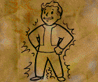

**Плюсы: 🟢**
- `+(Харизма * 2) к Уровню лечения.`
- `+8 к лечению суперстимуляторами.`
- `Вы восстанавливаете 1 ОЗ при каждом изменении ОД.`
- `Яд выводится из организма в 2 раза быстрее.`

**Минусы: 🔴**
- `Устойчивость к яду и Устойчивость к радиации уменьшается в 2 раза.`
- `Устойчивость к яду и Устойчивость к радиации от перков, наркотиков и предметов уменьшается в 2 раза.`

## Крушила

**Плюсы: 🟢**
- `+2 к Силе.`
- > 💡 **Примечание:** `Сила не может быть меньше 3.`
- `+25 к Рукопашным повреждениям`

**Минусы: 🔴**
- `-1 к ОД.`

## Хилое тело

**Плюсы: 🟢**
- `+1 к Ловкости.`
- > 💡 **Примечание:** `Ловкость не может быть меньше 2.`
- `+5% к Увороту.`
- `Вы восстанавливаете 10 ОЗ при Увороте.`

**Минусы: 🔴**
- `Каждая единица Силы дает меньше к Переносимому грузу.`

## Однорукий
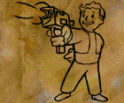

**Плюсы: 🟢**
- `+60% к навыку при расчете точности для одноручного оружия.`
- `+5 к урону для одноручного оружия.`
- `Игнорирование требования силы для одноручное оружие.`

**Минусы: 🔴**
- `-40% к навыку при расчете точности для двуручного оружия.`

## Точность
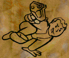

**Плюсы: 🟢**
- `+10% к Шансу на критическую атаку.`

**Минусы: 🔴**
- `+1 ОД к стоимости неприцельных атак.`

## Камикадзе
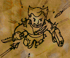

**Плюсы: 🟢**
- `+1 к Ловкости.`
- > 💡 **Примечание:** `Ловкость не может быть меньше 2.`
- `+1 од раз в 10 секунд.`
- `Эффект "Подавление" обнуляется первым тиком.`
- `+2 од за выстрел, который вводит вас в бой.`

**Минусы: 🔴**
- `Ваш класс брони всегда равен нулю.`

## Вор
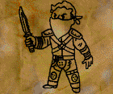

**Взаимоисключения: ❌**
- `Бесшумный бег`
- `Цепной пёс`
- `Пробивающий удар`

**Плюсы: 🟢**
- `+10 конечного урона для Холодного одноручного оружия и метательных ножей.`
- `При ношении боевой кожаной куртки вы получаете +10% к Увороту и -30 к критическому роллу по вам.`
- `При ношении боевой кожаной куртки, атаке Холодным одноручным оружием или метательным ножом и отсутствием таймера на восстановление Воровства вы кидаете цель в нокдаун и получаете 30 секунд к восстановлению Воровства, имеет один кд с ударом Ярости.`
- > 💡 **Примечание:** `Нокдаун = (Текущие ОД - 6 ОД). С перком Прыгучесть = (Текущие ОД - 3 ОД).`
- `Вы можете находить тайники при использовании Воровства на контейнер.`
- > 💡 **Примечание:** `Шанс зависит от Воровства.`
- > 💡 **Примечание:** `Время обновления тайников несколько реальных часов.`

**Минусы: 🔴**
- `Точность всего оружия кроме Холодного одноручного оружия и метательных ножей равна 5%.`
- > 💡 **Примечание:** `Максимальная точность всего оружия кроме Холодного одноручного оружия и метательных ножей будет 5% и меньше.`
- `Вы не можете критически атаковать.`

## Быстрый стрелок
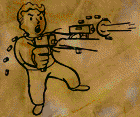

**Взаимоисключения: ❌**
- `Рефлексы`

**Плюсы: 🟢**
- `-1 ОД к стоимости атак для Легкого оружия, Тяжелого оружия, Энергооружия, Метательного оружия и Инженерного оружия.`
- > 💡 **Примечание:** `Инженерное оружие использует Ремонт в качестве боевого навыка.`

**Минусы: 🔴**
- `Вы не можете прицельно атаковать.`
- `Ваш критический урон не увеличивается.`
- `-(Уровень)% к навыку при расчете точности. Максимальный штраф = 40%.`

## Маньяк
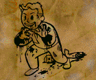

**Плюсы: 🟢**
- `+125% к Атлетизму.`
- `После убийства игрока вы можете бегать 3 секунды в боевом режиме.`
- > 💡 **Примечание:** `В боевом режиме все игроки передвигаются шагом.`
- `Жестокие анимации смерти для ваших жертв.`

**Минусы: 🔴**
- `Ваше оружие и броня ломается в 2 раза сильнее.`
- `Жестокие анимации смерти так же и для вас.`

## Дурной глаз
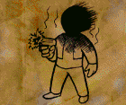

**Плюсы: 🟢**
- `50% шанс что промах по вам будет критическим.`
- `50% вероятности, что рана, которую накладывают на вас, отразится на противника.`
- `5% шанса, что санитар или суперстимулятор возымеют двойное действие.`
- `С вероятностью 50% ваши увороты будут считаться за промах при расчёте отрицательных эффектов для стреляющего по вам.`

**Минусы: 🔴**
- `50% шанс что ваш промах будет критическим`
- `5% шанса на то, что суперстимулятор не сработает, а санитар нанесёт урон в 70 хп.`

## Добродушие

**Взаимоисключения: ❌**
- `Бесшумный бег`
- `Неудержимый`
- `Терминатор`
- `Снайпер`
- `Дробила`
- `Ковбой.`

 **Плюсы: 🟢**
- `+25% к Санитару, +25% к Доктору, +25% к Красноречию и Торговле.`
- `Вы получаете перк каждые 2 уровня.`
- > 💡 **Примечание:** `Базовая скорость получения перков = 3.`
- > 💡 **Примечание:** `С трейтами Добродушие и Умелец вы будете получать перк каждые 3 уровня. Агрессивные НПС люди на случайных локациях нейтральны к вам.`
- > 💡 **Примечание:** `Нейтральное поведение НПС не работает на патрули Анклава. Они в любом случае агрессивны и начнут вас атаковать.`

**Минусы: 🔴**
- `Формула расчета ОЗ меняет на ((Выносливость * 7) + (Харизма * Харизма * 2)).`
- > 💡 **Примечание:**  `Расчет ОЗ без трейта Добродушие = (150 + (Сила * 3) + (Выносливость * 10) + (Ловкость * 2)).`
- `-15% к Легкому оружию, Тяжелому оружию и Энергооружию, -15% к Рукопашной, Метательному и Холодному оружию.`
- `При атаке оружием с типом урона Плазма цель не Нагревается и не получает тики Плазмы.`
- `Мастер перки связанные с типами урона не имеют бонусов.`
- > 💡 **Примечание:** `Мастер перки связанные с типами урона: Мастер урона, Мастер лазера, Мастер огня, Мастер плазмы, Мастер взрыва и Мастер электричества.`
- `Уворот делиться пополам.`
- `Восстановление ОЗ от Уровня лечения уменьшается в 2 раза.`
- `НПС животные на случайных локациях атакуют вас моментально.`

## Химик
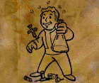

 **Плюсы: 🟢**
- `Длительность наркотиков увеличено в 3 раза.`
- `Откаты от наркотиков длятся 30 секунд.`
- `Вы можете использовать медикаменты после использовании печенья.`
- > 💡 **Примечание:** `Печенье снимает Рану, немного отравления.`

**Минусы: 🔴**
- `Шанс получить зависимость увеличен в 2 раза.`
- `Зависимость длятся в 3 раза дольше.`

## Стабильный
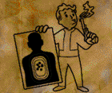

 **Плюсы: 🟢**
- `+1 к Восприятию.`
- > 💡 **Примечание:** `Восприятие не может быть меньше 2.`
- `+25% к навыку при расчете точности.`
- `Ваша атака не может быть критическим промахом.`

**Минусы: 🔴**
- `Ваша атака не может быть критической.`

## Жидкое тело
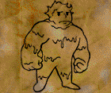

 **Плюсы: 🟢**
- `+50 к Переносимому груз`
- `-10 к конечному урону по вам.`
- `-50% к тикам огня.`

**Минусы: 🔴**
- `-20% штрафа от лечения санитаром.`
- `-20% штрафа от лечения суперстимулятором.`

## Умелец
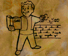

**Взаимоисключения: ❌**
- `Бесшумный бег`
- `Неудержимый`
- `Терминатор`
- `Снайпер`

 **Плюсы: 🟢**
- `+15 крита.`
- `+25 антикрита.`
- `+2 стата к Выносливости, Харизме, Интеллекту и Ловкости.`
- > 💡 **Примечание:**  `Выносливость, Харизма, Интелект, Ловкость не могут быть ниже 3`
- `+1 к Специальному навыку.`
- > 💡 **Примечание:** `Базовое значение Специальных навыков = 3.`
- > 💡 **Примечание:** `Специальный навык это тагнутый навык.`
- `+3 к Очкам умений за каждый уровень.`
- > 💡 **Примечание:** `Очки умений за каждый уровень = (5 + (Интеллект * 2)).`
- `При вашей атаке выход из боевого режима равен 5 секундам, но при атаке по вам боевой режим станет изначально зависящим от надетой брони.`

**Минусы: 🔴**
- `Вы получаете перк каждые 4 уровня.`
- > 💡 **Примечание:** `Базовая скорость получения перков = 3.`
- > 💡 **Примечание:** `С трейтами Добродушие и Умелец вы будете получать перк каждые 3 уровня.`

## Импульсивный
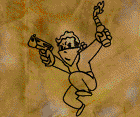

 **Плюсы: 🟢**
- `+1 к ОД.`
- `+20% к Метательному оружию.`
- `Восстановление ОД во время бега и ходьбы на 25% быстрее.`
- `+30% шанс восстановить 1 ОД при перезарядке.`

**Минусы: 🔴**
- `-3 к Очкам умений за каждый уровень`
- > 💡 **Примечание:** `Очки умений за каждый уровень = (5 + (Интеллект * 2)).`